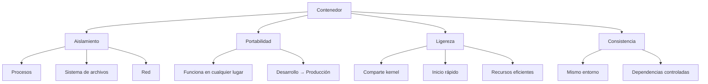
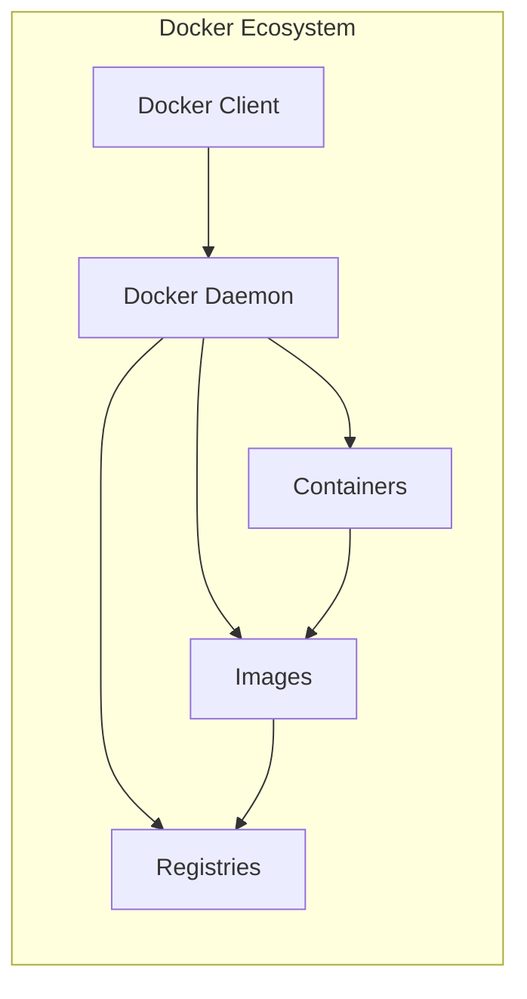
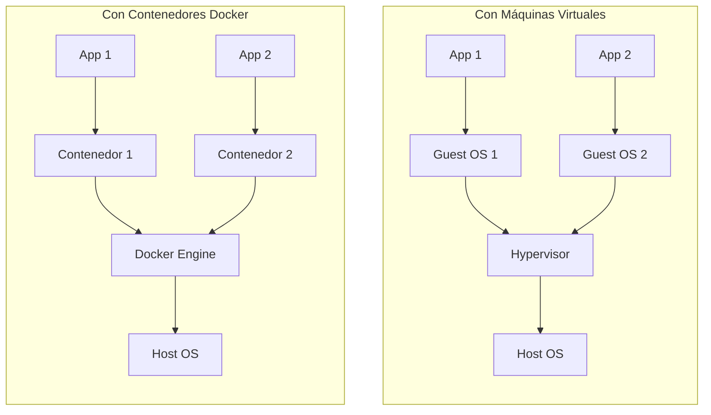

- [1. Contenedores y Docker](#1-contenedores-y-docker)
  - [1.1. Contenedores](#11-contenedores)
    - [1.1.1. Características de los Contenedores](#111-caracteristicas-de-los-contenedores)
  - [1.2. Docker](#12-docker)
    - [1.2.1. Componentes Principales de Docker](#121-componentes-principales-de-docker)
    - [1.2.2. Ventajas de Usar Docker](#122-ventajas-de-usar-docker)
    - [1.2.3. Conceptos Clave](#123-conceptos-clave)
    - [1.2.4. Docker vs Máquinas Virtuales](#124-docker-vs-maquinas-virtuales)
    - [1.2.5. Recursos Adicionales](#125-recursos-adicionales)

# 1. Contenedores y Docker

## 1.1. Contenedores

Un **contenedor** es una unidad de software que empaqueta una aplicación y todas sus dependencias, de modo que la aplicación se pueda ejecutar rápidamente y de manera fiable en cualquier entorno. Un contenedor estándar incluye todo lo necesario para ejecutar una aplicación: código, tiempo de ejecución, bibliotecas del sistema, herramientas del sistema y bibliotecas, y configuraciones.

### 1.1.1. Características de los Contenedores

## 1.2. Docker

**Docker** es una plataforma de código abierto que facilita la creación, implementación y ejecución de aplicaciones en contenedores. Docker permite a los desarrolladores empaquetar una aplicación con todas las partes necesarias en un contenedor, y a continuación, publicarla en un repositorio, desde donde se puede descargar y ejecutar en cualquier máquina.

### 1.2.1. Componentes Principales de Docker

### 1.2.2. Ventajas de Usar Docker

| Ventaja | Descripción |
|---------|-------------|
| **Aislamiento** | Cada contenedor tiene su propio entorno aislado |
| **Portabilidad** | Compatible con cualquier sistema que tenga Docker |
| **Escalabilidad** | Fácil replicación de contenedores |
| **Eficiencia** | Uso óptimo de recursos del sistema |
| **Reproducibilidad** | Entornos consistentes desarrollo-producción |

### 1.2.3. Conceptos Clave

📝 **Nota del Profesor:** Los contenedores son diferentes de las máquinas virtuales. Mientras que las VMs virtualizan todo el sistema operativo, los contenedores comparten el kernel del sistema operativo host, lo que los hace mucho más ligeros y rápidos de iniciar.

💡 **Tip del Examinador:** En el examen te pueden preguntar la diferencia entre contenedores y VMs. Recuerda: los contenedores aíslan procesos a nivel de aplicación, mientras que las VMs virtualizan el hardware completo.

### 1.2.4. Docker vs Máquinas Virtuales

### 1.2.5. Recursos Adicionales

- [Docker](https://www.docker.com/)
- [Tutorial de Docker](https://github.com/joseluisgs/docker-tutorial)

⚠️ **Advertencia de Seguridad:** Nunca almacenes secretos (contraseñas, tokens, claves API) directamente en imágenes Docker. Usa variables de entorno o secretos de Docker Swarm/Kubernetes.
