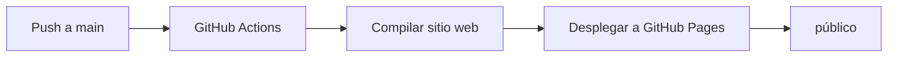

- [2. Despliegue de Web con GitHub Pages](#2-despliegue-de-web-con-github-pages)
  - [2.1. GitHub Pages](#21-github-pages)
  - [2.2. Desplegando mi primer sitio personal](#22-desplegando-mi-primer-sitio-personal)
  - [2.3. Publicando otros proyectos sobre tu usuario](#23-publicando-otros-proyectos-sobre-tu-usuario)
    - [Usando la rama `gh-pages`](#usando-la-rama-gh-pages)
    - [Usando la carpeta `/docs`](#usando-la-carpeta-docs)
  - [2.4. Práctica GitHub Pages](#24-práctica-github-pages)
  - [2.5. Pipelines CI/CD con GitHub Actions](#25-pipelines-cicd-con-github-actions)
    - [2.5.1. Flujo propuesto](#251-flujo-propuesto)
    - [2.5.2. Ejemplo: Workflow completo](#252-ejemplo-workflow-completo)
    - [2.5.3. Ejemplo alternativo: Push a Docker Hub](#253-ejemplo-alternativo-push-a-docker-hub)
    - [2.5.4. Buenas prácticas y consideraciones](#254-buenas-prácticas-y-consideraciones)
    - [2.5.5. ¿Qué modifica la Action en la web](#255-qué-modifica-la-action-en-la-web)


# 2. Despliegue de Web con GitHub Pages

## 2.1. GitHub Pages

GitHub Pages es un servicio de hosting estático que ofrece GitHub para alojar sitios web directamente desde un repositorio de GitHub. Es ideal para proyectos de documentación, blogs personales, páginas de portafolio y sitios web estáticos.

GitHub Pages utiliza GitHub Actions para compilar y desplegar el sitio web automáticamente cada vez que se realiza un push al repositorio. El sitio web se sirve desde un repositorio especial llamado `username.github.io`, donde `username` es tu nombre de usuario de GitHub.

Para crear un sitio web personal, debes crear un repositorio con el nombre `username.github.io`, donde `username` es tu nombre de usuario de GitHub. Por ejemplo, si tu nombre de usuario es `joseluisgs`, el repositorio debe llamarse `joseluisgs.github.io`.


💡 **Tip del Examinador:** GitHub Pages solo puede albergar sitios web estáticos (HTML, CSS, JavaScript). No puedes ejecutar código del lado del servidor como PHP, Python o Node.js.

## 2.2. Desplegando mi primer sitio personal

Para desplegar tu primer sitio personal con GitHub Pages, sigue estos pasos:

1. Crea un repositorio con el nombre `username.github.io`, donde `username` es tu nombre de usuario de GitHub.
2. Clona el repositorio en tu máquina local.
3. Crea un archivo `index.html` con el contenido de tu sitio web.
4. Añade, commitea y pushea los cambios a GitHub.
5. Accede a `https://username.github.io` para ver tu sitio web.

```bash
git clone https://github.com/username/username.github.io.git
cd username.github.io
echo "Hola Mundo" > index.html
git add .
git commit -m "Initial commit"
git push -u origin main
```

## 2.3. Publicando otros proyectos sobre tu usuario

Para publicar otros proyectos bajo tu usuario (no el repositorio especial), puedes usar la rama `gh-pages` o una carpeta `/docs` en la rama `main`.

### Usando la rama `gh-pages`

1. Crea una rama llamada `gh-pages` en tu repositorio.
2. Construye tu sitio web estático en la carpeta `/docs` o en la raíz del proyecto.
3. Commitea y pushea los cambios a la rama `gh-pages`.
4. Accede a `https://username.github.io/repo` para ver tu sitio web.

```bash
git checkout -b gh-pages
git push -u origin gh-pages
```

### Usando la carpeta `/docs`

1. Crea una carpeta `/docs` en la raíz de tu proyecto.
2. Añade los archivos de tu sitio web estático en la carpeta `/docs`.
3. Configura GitHub Pages para usar la carpeta `/docs` en la rama `main`.
4. Commitea y pushea los cambios.

```bash
mkdir docs
echo "Hola Mundo" > docs/index.html
git add docs
git commit -m "Add docs"
git push origin main
```

📝 **Nota del Profesor:** GitHub Pages puede usar cualquier rama como fuente de tu sitio web. Por defecto, usa la rama `gh-pages` para proyectos y la rama `main` para sitios personales.

## 2.4. Práctica GitHub Pages

Crea un sitio web personal con GitHub Pages. El sitio web debe incluir:
- Una página principal (`index.html`) con tu información personal.
- Una página de proyectos (`projects.html`) con tus proyectos destacados.
- Una página de contacto (`contact.html`) con tu información de contacto.
- Un archivo CSS con estilos para todas las páginas.

## 2.5. Pipelines CI/CD con GitHub Actions

GitHub Actions es una plataforma de integración continua y entrega continua (CI/CD) que te permite automatizar tus flujos de trabajo de desarrollo. Puedes usar GitHub Actions para compilar, probar y desplegar tu código directamente desde GitHub.

### 2.5.1. Flujo propuesto

El flujo propuesto para desplegar un sitio web con GitHub Pages es el siguiente:



### 2.5.2. Ejemplo: Workflow completo

Para desplegar un sitio web con GitHub Pages, puedes crear un workflow de GitHub Actions que compile y despliegue tu sitio web automáticamente cada vez que realices un push al repositorio.

```yaml
name: Deploy to GitHub Pages

on:
  push:
    branches:
      - main

jobs:
  deploy:
    runs-on: ubuntu-latest
    steps:
      - name: Checkout
        uses: actions/checkout@v3

      - name: Setup Node
        uses: actions/setup-node@v3
        with:
          node-version: '18'

      - name: Install dependencies
        run: npm install

      - name: Build
        run: npm run build

      - name: Deploy
        uses: peaceiris/actions-gh-pages@v3
        with:
          github_token: ${{ secrets.GITHUB_TOKEN }}
          publish_dir: ./build
```

💡 **Tip del Examinador:** El token `GITHUB_TOKEN` es un token de acceso especial que GitHub Actions proporciona automáticamente. No necesitas crear uno manualmente.

### 2.5.3. Ejemplo alternativo: Push a Docker Hub

Si quieres construir y publicar una imagen Docker en Docker Hub, puedes usar el siguiente workflow:

```yaml
name: Build and Push Docker

on:
  push:
    branches:
      - main

jobs:
  build:
    runs-on: ubuntu-latest
    steps:
      - name: Checkout
        uses: actions/checkout@v3

      - name: Set up Docker Buildx
        uses: docker/setup-buildx-action@v2

      - name: Log in to Docker Hub
        uses: docker/login-action@v2
        with:
          username: ${{ secrets.DOCKERHUB_USERNAME }}
          password: ${{ secrets.DOCKERHUB_TOKEN }}

      - name: Build and push
        uses: docker/build-push-action@v4
        with:
          context: .
          push: true
          tags: username/my-app:latest
```

### 2.5.4. Buenas prácticas y consideraciones

- Usa un archivo `.gitignore` para excluir archivos y carpetas que no deseas incluir en tu sitio web.
- Usa un archivo `README.md` para documentar tu proyecto y cómo contribuye al sitio web.
- Usa un archivo `docker-compose.yml` para definir los servicios de tu aplicación.
- Usa secretos de GitHub para almacenar información sensible como tokens de acceso y contraseñas.

⚠️ **Advertencia de Seguridad:** Nunca almacenes secretos (contraseñas, tokens, claves API) directamente en tu repositorio. Usa secretos de GitHub Actions para almacenar esta información de forma segura.

### 2.5.5. ¿Qué modifica la Action en la web

Cuando despliegas tu sitio web con GitHub Pages, la Action de GitHub Actions realiza las siguientes modificaciones en tu repositorio:

1. Compila tu sitio web estático (si es necesario).
2. Copia los archivos compilados en una carpeta especial llamada `gh-pages`.
3. Committea y pushea los cambios a la rama `gh-pages`.
4. GitHub Pages sirve los archivos de la rama `gh-pages` en la URL `https://username.github.io/repo`.

📝 **Nota del Profesor:** GitHub Pages solo sirve archivos estáticos. Si tu sitio web requiere compilación (como un sitio web de React o Angular), debes compilarlo antes de desplegarlo.
