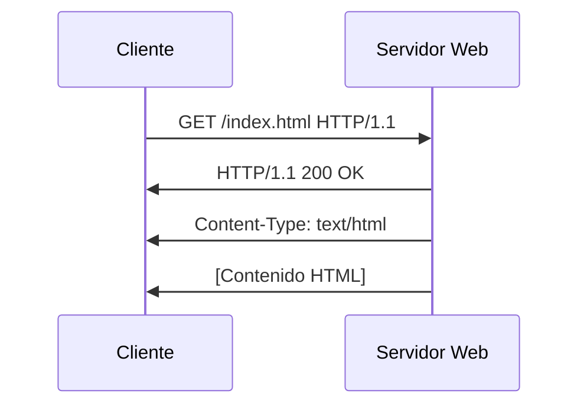
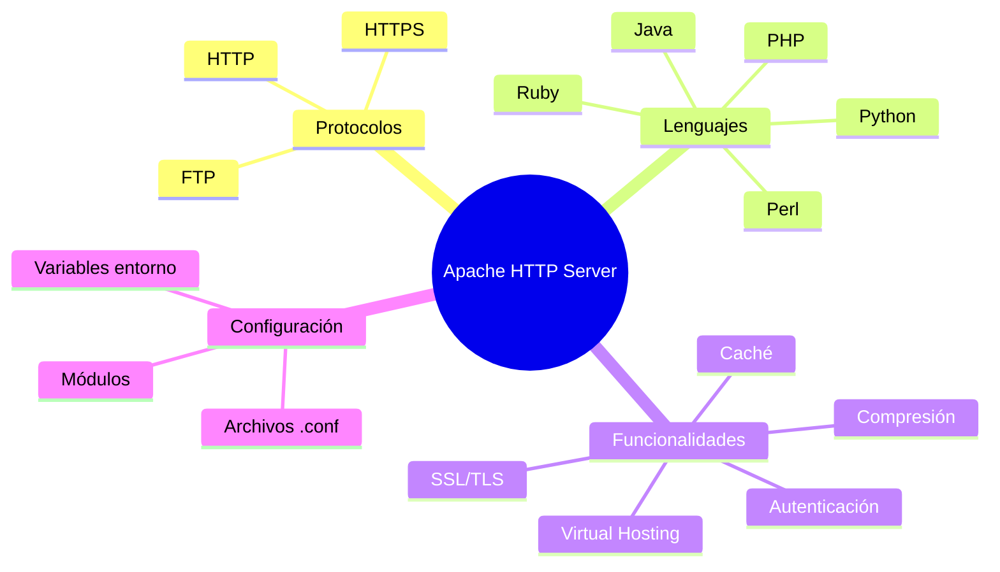

- [4. Despliegue de Servidores Web con Apache](#4-despliegue-de-servidores-web-con-apache)
  - [4.1. Servidor Web](#41-servidor-web)
    - [4.1.1. Protocolo HTTP](#411-protocolo-http)
  - [4.2. Apache Server](#42-apache-server)
    - [4.2.1. Características de Apache](#421-características-de-apache)
    - [4.2.2. Estructura de Directorios](#422-estructura-de-directorios)
    - [4.2.3. Comandos de Gestión](#423-comandos-de-gestión)
    - [4.2.4. Configuración Principal](#424-configuración-principal)
    - [4.2.5. Host Virtuales](#425-host-virtuales)
    - [4.2.6. Sites Available/Enables](#426-sites-availableenables)
    - [4.2.7. Dar de alta en la resolución de nombres del sistema operativo](#427-dar-de-alta-en-la-resolución-de-nombres-del-sistema-operativo)
    - [4.2.8. Despliegue con Docker](#428-despliegue-con-docker)
    - [4.2.9. Activación Modular en Docker](#429-activación-modular-en-docker)
    - [4.2.10. Logs y Monitorización en Contenedores](#4210-logs-y-monitorización-en-contenedores)
  - [4.3. Práctica Apache 01](#43-práctica-apache-01)
  - [4.4. Protegiendo un directorio o dominio](#44-protegiendo-un-directorio-o-dominio)
  - [4.5. Practica Apache 02](#45-practica-apache-02)
  - [4.6. Seguridad con SSL/TSL](#46-seguridad-con-ssltsl)
  - [4.7. Práctica Apache 03](#47-práctica-apache-03)
  - [4.8. Administración y Documentación Esencial](#48-administración-y-documentación-esencial)
    - [4.8.1. Comandos de Administración de Contenedores](#481-comandos-de-administración-de-contenedores)
    - [4.8.2. Documentación Esencial (*README.md*)](#482-documentación-esencial-readmemd)
        - [Despliegue de Apache con Docker Compose](#despliegue-de-apache-con-docker-compose)
  - [4.9. Monitorización de Logs Estructurados](#49-monitorización-de-logs-estructurados)
    - [4.9.1. Logs y Rotación Básica (json-file driver)](#491-logs-y-rotación-básica-json-file-driver)
    - [4.9.2. Consolidación y Análisis Centralizado (Log Shippers)](#492-consolidación-y-análisis-centralizado-log-shippers)
    - [4.9.3. Consolidación de Logs con Fluentd](#493-consolidación-de-logs-con-fluentd)
      - [Paso 1: Estructura de Archivos](#paso-1-estructura-de-archivos)
      - [Configuración de Fluentd (`fluentd/td-agent.conf`)](#configuración-de-fluentd-fluentdtd-agentconf)
      - [Paso 3: Actualizar Docker Compose (`docker-compose.yml`)](#paso-3-actualizar-docker-compose-docker-composeyml)
      - [Paso 4: Ejecución y Verificación](#paso-4-ejecución-y-verificación)
    - [4.9.4. Herramientas Clave de Visualización de Logs](#494-herramientas-clave-de-visualización-de-logs)
    - [4.9.5. Kibana (Elastic Stack)](#495-kibana-elastic-stack)
        - [Extender la Configuración de Fluentd](#extender-la-configuración-de-fluentd)
        - [Actualizar Docker Compose para ELK](#actualizar-docker-compose-para-elk)
        - [Ejecución y Uso de Kibana](#ejecución-y-uso-de-kibana)


# 4. Despliegue de Servidores Web con Apache

## 4.1. Servidor Web

Un servidor web es un software que utiliza el protocolo HTTP para servir archivos que forman páginas web a los usuarios, en respuesta a sus solicitudes, que son reenviadas por sus aplicaciones clientes, normalmente un navegador web.

Los servidores web son componentes esenciales de la infraestructura de Internet. Todos los sitios web y aplicaciones web necesitan un servidor web para servir sus archivos a los usuarios.

Los servidores web pueden ser servidores web estáticos o servidores web dinámicos. Los servidores web estáticos sirven archivos estáticos, como páginas HTML, CSS, imágenes y otros archivos multimedia, mientras que los servidores web dinámicos generan contenido de forma dinámica, normalmente a partir de una base de datos usando un lenguaje de programación del lado del servidor, como PHP, Python, Ruby, Java, Node.js, etc.

💡 **Tip del Examinador:** En el examen pueden pedirte la diferencia entre servidor web estático y dinámico. El estático sirve archivos predefinidos, el dinámico genera contenido bajo demanda.

Algunos de los servidores web más populares son:
- Apache HTTP Server: [Apache](https://httpd.apache.org/)
- Nginx: [Nginx](https://www.nginx.com/)
- Microsoft Internet Information Services (IIS): [IIS](https://www.iis.net/)

### 4.1.1. Protocolo HTTP

El protocolo de transferencia de hipertexto (HTTP) es un protocolo de comunicación que se utiliza para la transmisión de información en la World Wide Web. HTTP define cómo se envían y reciben las solicitudes y respuestas entre los clientes y los servidores web.

HTTP es un protocolo sin estado, lo que significa que cada solicitud y respuesta es independiente de las anteriores. Cada solicitud HTTP se trata de forma independiente, sin tener en cuenta las solicitudes anteriores.

Una solicitud HTTP consta de un método (GET, POST, PUT, DELETE, etc.), una URL, una versión del protocolo, encabezados y, opcionalmente, un cuerpo de mensaje. Una respuesta HTTP consta de una versión del protocolo, un código de estado, encabezados y, opcionalmente, un cuerpo de mensaje.



Algunos de los códigos de estado HTTP más comunes son:
- 200 OK: La solicitud se ha completado correctamente.
- 404 Not Found: El recurso solicitado no se ha encontrado en el servidor.
- 500 Internal Server Error: Error interno del servidor.

📝 **Nota del Profesor:** Memoriza los códigos de estado más comunes (200, 301, 404, 500). Son fundamentales para troubleshooting.

## 4.2. Apache Server

Apache HTTP Server, comúnmente conocido como Apache, es un servidor web de código abierto y gratuito desarrollado y mantenido por la Apache Software Foundation. Apache es uno de los servidores web más populares del mundo y se utiliza para servir una gran cantidad de sitios web y aplicaciones web.


Apache es un servidor web multiplataforma que se ejecuta en sistemas operativos Unix, Linux, Windows y otros sistemas operativos. Apache es altamente configurable y extensible, y soporta una amplia variedad de módulos y extensiones que permiten añadir funcionalidades adicionales al servidor web.

### 4.2.1. Características de Apache



Algunas de las características de Apache son:
- Soporte para múltiples protocolos, incluyendo HTTP, HTTPS, FTP, y más.
- Soporte para múltiples lenguajes de programación, incluyendo PHP, Python, Perl, Ruby, Java, y más.
- Soporte para autenticación y autorización basada en usuarios y grupos.
- Soporte para compresión de contenido y caché de páginas web.
- Soporte para virtual hosting, que permite alojar múltiples sitios web en un solo servidor.
- Soporte para SSL/TLS, que permite cifrar la comunicación entre el servidor y los clientes.
- Soporte para módulos y extensiones que añaden funcionalidades adicionales al servidor web.
- Soporte para la configuración mediante archivos de configuración y variables de entorno.
- Soporte para la monitorización y el registro de eventos y errores.

Para instalar Apache en un sistema Linux, puedes utilizar el gestor de paquetes de tu distribución. Por ejemplo, en Ubuntu puedes instalar Apache con el siguiente comando:

```bash
sudo apt-get install apache2 # servidor web
sudo apt-get install apache2-utils # utilidades de apache
```

### 4.2.2. Estructura de Directorios

La configuración de Apache está distribuida en varios archivos y directorios para facilitar su gestión y modularidad. La estructura es la siguiente:
```
/etc/apache2/
|-- apache2.conf
|   `-- ports.conf
|-- mods-enabled
|   |-- *.load
|   |-- *.conf
|-- conf-enabled
|   `-- *.conf
`-- sites-enabled
    `-- *.conf
```

- apache2.conf: Archivo de configuración principal de Apache donde se realizan cambios generales.
- envvars: Configuración de las variables de entorno.
- ports.conf: Configuración de los puertos en los que Apache escucha.
- conf-available: Ficheros de configuración adicionales para varios aspectos de Apache o aplicaciones web.
- conf-enabled: Enlaces simbólicos a los ficheros de configuración adicionales para activarlos. Se gestionan con los comandos a2enconf y a2disconf.
- mods-available: Módulos disponibles para usar con Apache.
- mods-enabled: Enlaces simbólicos a los módulos de Apache que están activados.
- sites-available: Ficheros de configuración de hosts virtuales disponibles. Se gestionan con los comandos a2enmod y a2dismod.
- sites-enabled: Enlaces simbólicos a los fiche ros de configuración de hosts virtuales activos. Se gestionan con los comandos a2ensite y a2dissite.

### 4.2.3. Comandos de Gestión

Comprobar el estado:
```bash
sudo service apache2 status
```

Detener el servidor:
```bash
sudo service apache2 stop
```

Iniciar el servicio:
```bash
sudo service apache2 start
```

Reiniciar el servidor:
```bash
sudo service apache2 restart
```

Obtener información del servidor:
```bash
apache2 -v
```

### 4.2.4. Configuración Principal

apache2.conf:

Archivo principal de configuración con directivas generales.
Incluye configuraciones como:

```apache	
<Directory /var/www/>
    Options Indexes FollowSymlinks
    AllowOverride None
    Require all granted
</Directory>
AccessFileName .htaccess # nombre del archivo de configuración
Include ports.conf # incluye el archivo de configuración de puertos
KeepAlive On # mantiene la conexión abierta
```

ports.conf:

Configura los puertos en los que Apache escucha.
Ejemplo de configuración:
```apache
Listen 80 # puerto por defecto

<IfModule ssl_module>
	Listen 443
</IfModule>

<IfModule mod_gnutls.c>
	Listen 443
</IfModule>
```

### 4.2.5. Host Virtuales

Los hosts virtuales permiten alojar múltiples sitios web en un solo servidor. Cada host virtual tiene su propio directorio raíz, configuración y archivos de registro.

Por defecto, Apache tiene un host virtual configurado en /etc/apache2/sites-available/000-default.conf. Puedes añadir nuevos hosts virtuales creando archivos de configuración en el directorio /etc/apache2/sites-available/ y activándolos con los comandos a2ensite y a2dissite.

La estructura de un archivo de configuración de host virtual es la siguiente:

```apache
<VirtualHost *:80>
    ServerAdmin joseluis.gonzalez@iesluisvives.org # dirección de correo del administrador
    DocumentRoot /var/www/dominio.com # directorio raíz del sitio web
    ServerName dominio.com # nombre del servidor
    ServerAlias www.dominio.com # alias del servidor

    
    #LogLevel info ssl:warn
 
    ErrorLog ${APACHE_LOG_DIR}/error.log
    CustomLog ${APACHE_LOG_DIR}/access.log combined


    <Directory /var/www/dominio.com> 
      Options Indexes FollowSymLinks # opciones del directorio
      AllowOverride All # habilita la reescritura de URL
      Require all granted # permisos de acceso
    </Directory>

</VirtualHost>
```

💡 **Tip del Examinador:** El VirtualHost es la clave para alojar múltiples sitios en un mismo servidor. Cada dominio tiene su propia configuración.

### 4.2.6. Sites Available/Enables

- sites-available: Directorio que contiene los archivos de configuración de los hosts virtuales disponibles.
- sites-enabled: Directorio que contiene enlaces simbólicos a los archivos de configuración de los hosts virtuales activos.

Para activar un host virtual, puedes crear un archivo de configuración en sites-available y activarlo con el comando a2ensite. Por ejemplo:

```bash
sudo cp /etc/apache2/sites-available/000-default.conf /etc/apache2/sites-available/mi-sitio.conf
sudo a2ensite mi-sitio.conf
sudo service apache2 reload
```

Para desactivar un host virtual, puedes usar el comando a2dissite. Por ejemplo:

```bash
sudo a2dissite mi-sitio.conf
sudo service apache2 reload
```

### 4.2.7. Dar de alta en la resolución de nombres del sistema operativo

Para que el servidor web pueda ser accedido por un nombre de dominio en lugar de una dirección IP, es necesario dar de alta el nombre en la resolución de nombres del sistema operativo.

En Linux lo haremos en el archivo /etc/hosts. Por ejemplo, si queremos acceder al servidor web con el nombre dominio.com, añadiremos la siguiente línea al archivo /etc/hosts:

```bash
127.0.0.1 dominio.com
```

En Windows, el archivo de hosts se encuentra en C:\Windows\System32\drivers\etc\hosts. Para editarlo, necesitarás permisos de administrador.
```bash
127.0.0.1 dominio.com
```

⚠️ **Advertencia de Seguridad:** El archivo hosts es un objetivo común para malware. Modificarlo puede afectar la resolución de nombres.

### 4.2.8. Despliegue con Docker

Imaginemos que queremos desplegar un servidor web Apache en un contenedor Docker con dos dominios virtuales llamado dominio-one.com y dominio-two.com usando Docker-Compose.

En nuestro directorio de trabajo podemos tener los siguientes archivos de configuración:
- docker-compose.yml: Archivo de configuración de Docker-Compose.
- sites-available: Directorio con los archivos de configuración de los hosts virtuales.
  - dominio-one.conf: Archivo de configuración del host virtual dominio-one.com.
  - dominio-two.conf: Archivo de configuración del host virtual dominio-two.com.
- websites: Directorio con los archivos de los sitios web.
  - dominio-one: Directorio con los archivos del sitio web dominio-one.com.
  - dominio-two: Directorio con los archivos del sitio web dominio-two.com.
- apache2.conf: Archivo de configuración principal de Apache.
- ports.conf: Archivo de configuración de los puertos de Apache.

De esta manera un ejemplo de docker-compose.yml sería:

```yaml
services:
  web:
    image: ubuntu/apache2 # imagen de Apache
    container_name: apache_server # nombre del contenedor
    ports:
      - "8080:80" # mapeo de puertos
    volumes:
      - ./apache2.conf:/etc/apache2/apache2.conf # archivo de configuración principal
      - ./sites-available:/etc/apache2/sites-available # archivos de configuración de hosts virtuales
      - ./websites:/var/www/html/ # directorio de los sitios web
    restart: always # reinicio automático
    # comando para activar los hosts virtuales y arrancar Apache
```

📝 **Nota del Profesor:** Usar Docker para Apache permite reproducir entornos de producción fácilmente y facilita la portabilidad.

### 4.2.9. Activación Modular en Docker

Para habilitar módulos como rewrite o ssl, lo hacemos durante la construcción de la imagen en el Dockerfile o al inicio del contenedor o mediante un script de entrypoint.

### 4.2.10. Logs y Monitorización en Contenedores

Concepto Clave: Los servidores en Docker deben enviar sus logs a STDOUT (Salida Estándar) y STDERR (Salida de Error Estándar). El Docker Engine es el que los recolecta y los gestiona, permitiendo monitorización externa.

En las imágenes oficiales de Apache, los logs ya están redirigidos a estas salidas:

Ahora solo tendríamos que ejecutar el comando docker-compose up -d para desplegar el servidor web Apache en un contenedor Docker.

```bash
docker-compose up -d
```

Añade estas entradas al archivo /etc/hosts:

```bash
127.0.0.1 dominio-one.com
127.0.0.1 dominio-two.com
```

Ahora entramos al contenedor y activamos los dominios virtuales y reiniciamos apache
```bash
docker exec -it apache_server bash
a2ensite dominio-one.com.conf
a2ensite dominio-two.com.conf
service apache2 reload
```

Para agilizar el proceso, en el ejemplo apache-init, se ha hecho un script que automatiza la activación de los dominios virtuales y el reinicio de Apache y añadido este script al archivo de configuración de Docker-Compose como su entrypoint.

```bash
#!/bin/bash
#!/bin/bash

# Habilitar los sitios
a2ensite dominio-one.com
a2ensite dominio-two.com

# Recargar la configuración de Apache
service apache2 reload

# Iniciar Apache en primer plano
apache2ctl -D FOREGROUND
```

💡 **Tip del Examinador:** El script de entrypoint es esencial para automatizar la configuración al iniciar el contenedor.

Y acceder a los sitios web dominio-one.com y dominio-two.com en el navegador web. ¡OJO con los puertos! quizás debas usarlos, por ejemplo http://dominio-one.com:8080 según lo que hayas configurado.

## 4.3. Práctica Apache 01

Crear dos paginas web en dos dominios tunombre.net (por ejemplo pepeperez.net) y tunombre.org (por ejemplo pepeperez.org) con un mensaje de bienvenida en cada una de ellas. Desplegar un servidor web Apache en un contenedor Docker con dos dominios virtuales usando Docker-Compose.

## 4.4. Protegiendo un directorio o dominio

Podemos proteger un dominio o directorio de un dominio gracias a Apache. Para ello debemos ejecutar el comando:
```bash
htpasswd -c /etc/apache2/.htpasswd usuario
```

Este comando genera el archivo .htpasswd en el directorio /etc/apache2/ y añade el usuario usuario con su contraseña. Para añadir más usuarios, ejecutamos el comando sin la opción -c.

A partir de aquí podemos proteger un directorio o dominio añadiendo las siguientes líneas al archivo de configuración del host virtual:

```apache
<Directory /var/www/dominio.com/privado>
    AuthType Basic
    AuthName "Área restringida"
    AuthUserFile /etc/apache2/.htpasswd
    Require valid-user
</Directory>
```

De manera global, podemos hacerlo añadiendo las siguientes líneas al archivo de configuración principal de Apache:

```apache
<Directory /var/www/>
    Options Indexes FollowSymLinks
    AllowOverride All
    Require all granted
</Directory>
```

Y luego teniendo un archivo .htaccess en el directorio que queremos proteger con el siguiente contenido:

```apache
AuthType Basic
AuthName "Área restringida"
AuthUserFile /etc/apache2/.htpasswd
Require valid-user
```

Puedes personalizar el mensaje de error 404 y otras añadiendo las siguientes líneas al archivo de configuración del host virtual:

```apache
ErrorDocument 404 /error404.html
```

Reiniciamos y listo. Puedes ver el ejemplo en la carpeta apache-htpasswd.

## 4.5. Practica Apache 02

Crea un directorio privado en el dominio tunombre.org (por ejemplo pepeperez.org) y protegelo con una contraseña, por ejemplo pepeperez. Despliega un servidor web Apache en un contenedor Docker con dos dominios virtuales usando Docker-Compose.
Además añade páginas personalizadas de error 404 y 500.

## 4.6. Seguridad con SSL/TSL

Lo primero que debemos hacer es generar un certificado con OpenSSL. Puedes instalarlo en tu sistema con el siguiente comando:

```bash
sudo apt-get install openssl
```

O en Windows desde la página oficial de [Win32OpenSSL](https://slproweb.com/products/Win32OpenSSL.html).

Para ello ejecutamos el siguiente comando en un directorio llamado certs:

```bash
openssl req -x509 -nodes -days 365 -newkey rsa:2048 -keyout dominio-two.key -out dominio-two.crt
```

El siguiente paso es ajustar la seguridad de nuestro Virtual Host añadiendo las siguientes líneas al archivo de configuración del host virtual:

```apache
<VirtualHost *:80>
    # Redireccion de todo 80 a 443
    ServerName dominio-two.com
    ServerAlias www.dominio-two.com
    Redirect / https://dominio-two.com/
</VirtualHost>

<VirtualHost *:443>
    ServerAdmin joseluis.gonzalez@iesluisvives.org
    DocumentRoot /var/www/html/dominio-two.com
    ServerName dominio-two.com
    ServerAlias www.dominio-two.com

    # Configuración SSL
    SSLEngine On
    SSLCertificateFile /etc/apache2/certs/dominio-two.crt
    SSLCertificateKeyFile /etc/apache2/certs/dominio-two.key 

    # Habilitar protocolos seguros
    SSLProtocol All -SSLv3

    # Protección de directorio
    <Directory "/var/www/html/dominio-two.com/privado">
        AuthType Basic
        AuthName "Acceso Restringido a Usuarios"
        AuthUserFile /etc/apache2/.htpasswd
        Require valid-user
        Options -Indexes
    </Directory>
</VirtualHost>
```

⚠️ **Advertencia de Seguridad:** Los certificados autofirmados solo deben usarse en desarrollo. En producción usa Let's Encrypt o certificados de una CA.

 debemos copiar los archivos dominio-two.crt y dominio-two.key al directorio /etc/apache2/certs y reiniciar el servidor Apache.

Posteriormente debemos instalar el módulo SSL de Apache:

```bash
sudo a2enmod ssl
```

Y reiniciar el servidor Apache:

```bash
sudo service apache2 restart
```

No olvides en docker-compose.yml mapear el puerto 443:

Se ha automatizado el proceso en el archivo entrypoint.sh.

Puedes ver un ejemplo en la carpeta apache-ssl.

## 4.7. Práctica Apache 03

Configura el dominio tunombre.org (por ejemplo pepeperez.org) con SSL/TSL. Despliega un servidor web Apache en un contenedor Docker con dos dominios virtuales usando Docker-Compose.

## 4.8. Administración y Documentación Esencial

Para administrar un despliegue de Apache en **Docker Compose** de manera eficiente, es crucial dominar los comandos clave de Docker y establecer una **documentación** clara que sirva como manual de operaciones (*runbook*).

### 4.8.1. Comandos de Administración de Contenedores

La administración del servidor web ya no se hace con `sudo service apache2 <comando>` en el host, sino a través de la CLI de Docker Compose, dirigida al servicio específico.

| Tarea                       | Comando Clave                                      | Descripción y Contexto                                                                                                                                                                                                      |
| :-------------------------- | :------------------------------------------------- | :-------------------------------------------------------------------------------------------------------------------------------------------------------------------------------------------------------------------------- |
| **Despliegue inicial**      | `docker-compose up -d`                             | Lanza todos los servicios definidos en `docker-compose.yml` en modo *detached* (segundo plano). Si se usa la directiva `build`, primero construye la imagen.                                                                |
| **Acceso a Consola**        | `docker exec -it apache_server bash`               | **Acceso esencial para la administración.** Ejecuta una terminal (`bash`) interactiva (`-i`) y con TTY (`-t`) dentro del contenedor llamado `apache_server`. Permite realizar tareas internas (ej. `a2ensite`, `htpasswd`). |
| **Verificar Configuración** | `docker exec apache_server apache2ctl configtest`  | **Comando de seguridad.** Ejecuta la utilidad de chequeo de sintaxis de Apache **dentro del contenedor**. Se usa para verificar que un nuevo Virtual Host o cambio de módulo no romperá el servidor antes de recargar.      |
| **Recarga de Config.**      | `docker exec apache_server service apache2 reload` | **Recarga suave.** Envía la señal al proceso principal de Apache para que relea los archivos de configuración (ej. nuevos Hosts Virtuales montados por volumen) sin detener el servicio, minimizando el *downtime*.         |
| **Parada segura**           | `docker-compose stop`                              | Detiene la ejecución de los contenedores de forma controlada, preservando su estado (si se reinicia con `start`, continuarán).                                                                                              |
| **Limpieza total**          | `docker-compose down`                              | Detiene y elimina los contenedores, redes y volúmenes **no nombrados**. Use `docker-compose down -v` para eliminar volúmenes nombrados, ideal para empezar desde cero.                                                      |
| **Reconstrucción forzada**  | `docker-compose up -d --build`                     | Fuerza la reconstrucción de la imagen, incluso si no ha habido cambios en el `Dockerfile`. Necesario si cambias la base de la imagen o dependencias.                                                                        |

💡 **Tip del Examinador:** El comando `apache2ctl configtest` es tu mejor amigo antes de recargar Apache. Siempre úsalo.

### 4.8.2. Documentación Esencial (*README.md*)

Una buena práctica es incluir un archivo `README.md` en la raíz del proyecto para documentar los pasos de despliegue, la arquitectura y los comandos clave. Esto facilita el trabajo a cualquier desarrollador o administrador nuevo.

**Contenido Mínimo de Documentación:**

##### Despliegue de Apache con Docker Compose

1. Requisitos
- Docker Engine (v20.10+)
- Docker Compose (v2.0+)

2. Estructura del Proyecto
- `docker-compose.yml`: Define los servicios (web, logs).
- `websites/`: Contiene el código fuente de los sitios web (DocumentRoot).
- `sites-available/`: Configuraciones de Virtual Hosts (montados en /etc/apache2/sites-available).
- `certs/`: Certificados SSL/TLS.

3. Despliegue y Acceso

1. **Configuración de Hosts Local (Solo pruebas):**
   Añada las siguientes líneas a su archivo `/etc/hosts` (o equivalente en Windows):
```
127.0.0.1 dominio-one.com
127.0.0.1 dominio-two.com
```

2. **Iniciar el Servidor:**
```bash
docker-compose up -d
```

3.  **Acceso:**
      - Sitio 1 (HTTP): `http://dominio-one.com:8080`
      - Sitio 2 (HTTPS): `https://dominio-two.com:8443`

4\. Comandos de Mantenimiento

| Tarea                             | Comando                                            |
| :-------------------------------- | :------------------------------------------------- |
| **Verificar logs en tiempo real** | `docker logs -f web`                               |
| **Acceder a la consola**          | `docker exec -it apache_server bash`               |
| **Verificar sintaxis de Apache**  | `docker exec apache_server apache2ctl configtest`  |
| **Recargar configuración**        | `docker exec apache_server service apache2 reload` |

## 4.9. Monitorización de Logs Estructurados

Para un entorno de producción, la monitorización eficaz requiere que los logs no se queden en el contenedor, sino que sean **consolidables** y **analizables**.

### 4.9.1. Logs y Rotación Básica (json-file driver)

Por defecto, Docker Engine captura la salida de `STDOUT` y `STDERR` en formato **JSON** y la almacena en el sistema de archivos del host. Es crucial limitar el tamaño de estos archivos con la **rotación de logs** para evitar que consuman todo el espacio del disco.

**Ejemplo de configuración de Rotación en `docker-compose.yml`:**

```yaml
version: '3.8'
services:
  web:
    image: httpd:2.4
    container_name: apache_server
    ports:
      - "80:80"
    # --- CONFIGURACIÓN DE LOGGING ---
    logging:
      driver: "json-file" # Usar el driver JSON por defecto
      options:
        max-size: "10m" # Tamaño máximo que tendrá cada archivo de log (10 MB)
        max-file: "3"   # Número máximo de archivos a mantener (mantiene 3 archivos de 10 MB)
```

**Resultado:** Docker Engine rotará los logs del contenedor `web` al alcanzar 10 MB, manteniendo solo los 3 archivos más recientes.

### 4.9.2. Consolidación y Análisis Centralizado (Log Shippers)

Para la monitorización de logs de múltiples servicios (ej. un servidor de aplicaciones, una base de datos y Apache), se utiliza un **driver de logging** para **enviar** los logs a un recolector centralizado (un *log shipper*) como **Fluentd**, **Logstash**, o directamente a un servidor **Syslog** (como Graylog o Splunk).

**Ejemplo Avanzado con Fluentd para Consolidación de Logs:**

Este ejemplo define dos servicios en Docker Compose: `web` (Apache) que **emite** logs y `fluentd` que los **recibe** y almacena.

**a) Archivo `docker-compose.yml` (Configuración Avanzada):**

```yaml
version: '3.8'
services:
  # 1. Servicio Apache: Emisor de Logs
  web:
    image: httpd:2.4
    container_name: apache_web
    ports:
      - "8080:80"
    volumes:
      - ./websites:/usr/local/apache2/htdocs
    # Configuración para usar el driver fluentd
    logging:
      driver: "fluentd"
      options:
        # Dirección del colector (el servicio 'fluentd') y el puerto por defecto (24224)
        fluentd-address: fluentd:24224 
        tag: httpd.access.apache # Etiqueta para identificar este origen de log en el colector

  # 2. Servicio Fluentd: Colector de Logs (Necesitaría su propia configuración para guardar/analizar)
  fluentd:
    image: fluent/fluentd:latest
    container_name: log_collector
    ports:
      - "24224:24224"
    volumes:
      # Montar la configuración para que Fluentd sepa dónde enviar los logs
      - ./fluentd/conf:/fluentd/etc
      - ./fluentd/log:/fluentd/log
    # Asegurar que se reinicia si falla
    restart: always

# Definir la red para que los contenedores puedan comunicarse por nombre de servicio
networks:
  default:
    name: logs_network
```

**b) Funcionamiento:**

1.  Apache genera un log (ej. un acceso `200 OK`).
2.  Docker Engine captura la salida (STDOUT/STDERR).
3.  El *logging driver* `fluentd` redirige este log al servicio `fluentd:24224`.
4.  El servicio `fluentd` recibe el log, lo etiqueta con `httpd.access.apache` y, según su configuración interna (en `./fluentd/conf`), lo envía a un almacén central (ej. Elasticsearch, base de datos).

Este método permite la **monitorización, consolidación y análisis en tiempo real** de la actividad del servidor web.

📝 **Nota del Profesor:** Centralizar logs es fundamental en producción para debugging y análisis de seguridad.

### 4.9.3. Consolidación de Logs con Fluentd

Para centralizar, estructurar y analizar los logs de Apache en un entorno de producción, puedes usar **Fluentd** (un *Log Shipper* de código abierto).

**Objetivo:** Configurar Apache para que envíe sus logs a un servicio Fluentd en un entorno Docker Compose.

#### Paso 1: Estructura de Archivos

Crea un nuevo directorio llamado `fluentd` en la raíz de tu proyecto, junto a tu `docker-compose.yml`.

```
/tu_proyecto
├── docker-compose.yml
├── apache-init.sh
├── sites-available/
├── websites/
└── fluentd/
    └── td-agent.conf  <-- Archivo de configuración de Fluentd
```

#### Configuración de Fluentd (`fluentd/td-agent.conf`)

Crea un archivo de configuración básico para Fluentd. En este ejemplo, configuramos un *input* para recibir logs por TCP/TLS (por defecto del driver de Docker) y un *output* para escribirlos en un archivo simple de texto (para propósitos de demostración).

```conf
# 1. INPUT: Recibir logs de Docker a través del driver Fluentd (puerto 24224)
<source>
  @type forward
  port 24224
  bind 0.0.0.0
</source>

# 2. MATCH: Filtrar logs etiquetados como 'httpd.access.apache'
# Esta etiqueta se define en el docker-compose.yml del servicio Apache.
<match httpd.access.apache>
  @type file
  # Path donde Fluentd guardará los logs recibidos dentro de su contenedor
  path /fluentd/log/apache_access
  # Formato de los logs guardados
  <buffer>
    timekey 1d # Rota cada día
    timekey_use_utc true
    flush_interval 1s
  </buffer>
</match>
```

#### Paso 3: Actualizar Docker Compose (`docker-compose.yml`)

Añade el servicio `fluentd` y configura el servicio `web` para usar el *logging driver* `fluentd`.

```yaml
version: '3.8'
services:
  # 1. Servicio APACHE (Emisor de Logs)
  web:
    build: .
    container_name: apache_server
    ports:
      - "8080:80"
    volumes:
      # ... otros volúmenes
      - ./apache-init.sh:/usr/local/bin/apache-init.sh
    restart: always
    entrypoint: /usr/local/bin/apache-init.sh
    # --- CONFIGURACIÓN DE LOGGING: ENVIAR A FLUENTD ---
    logging:
      driver: "fluentd"
      options:
        # Apunta al nombre del servicio Fluentd y el puerto 24224
        fluentd-address: fluentd:24224 
        # Etiqueta de logs usada para el filtrado en td-agent.conf
        tag: httpd.access.apache

  # 2. Servicio FLUENTD (Colector de Logs)
  fluentd:
    image: fluent/fluentd:latest
    container_name: log_collector
    ports:
      # Puerto para recibir logs
      - "24224:24224"
    volumes:
      # Montar la configuración de Fluentd
      - ./fluentd/td-agent.conf:/fluentd/etc/td-agent.conf:ro
      # Volumen persistente para almacenar los logs recibidos (Output File)
      - ./fluentd/logs:/fluentd/log 
    restart: always

# Definir una red para que los servicios se encuentren fácilmente
networks:
  default:
    name: logs_network 
```

#### Paso 4: Ejecución y Verificación

1.  **Despliega el stack:**
```bash
docker-compose up -d
```

2.  **Genera tráfico:**
    Accede a tu servidor Apache (`http://dominio-one.com:8080`) varias veces desde el navegador.

3.  **Verifica los logs en el host:**
    Comprueba el nuevo directorio `fluentd/logs` que se ha creado en tu host. Deberías encontrar un archivo (`apache_access.<fecha>.log`) con los logs de acceso de Apache, confirmando que **Fluentd está recibiendo y procesando la información**.
```bash
# En tu host:
cat fluentd/logs/apache_access.*.log
```

Este método centraliza los logs, permitiendo una gestión y monitorización avanzada separada del servidor web.

-----

### 4.9.4. Herramientas Clave de Visualización de Logs

| Herramienta       | Función Principal                           | Contexto                                                                                                                                                                       |
| :---------------- | :------------------------------------------ | :----------------------------------------------------------------------------------------------------------------------------------------------------------------------------- |
| **Kibana**        | **Visualización, Dashboards y Exploración** | La interfaz gráfica de usuario estándar para buscar, analizar y visualizar los datos indexados por Elasticsearch.                                                              |
| **Elasticsearch** | **Almacenamiento e Indexación**             | El motor de búsqueda y análisis distribuido donde se almacenan y estructuran los logs recibidos (por ejemplo, a través de Fluentd o Logstash).                                 |
| **Logstash**      | **Procesamiento y Transformación**          | Una herramienta alternativa a Fluentd (o complementaria) que toma datos de múltiples fuentes, los transforma (normaliza, etiqueta) y los envía a Elasticsearch.                |
| **Grafana**       | **Visualización de Métricas y Logs**        | Una plataforma *open-source* muy popular para crear *dashboards* sobre logs y métricas. Se conecta a Elasticsearch (u otras bases de datos) para visualizar los datos.         |
| **Graylog**       | **Plataforma Completa de Gestión de Logs**  | Es una solución integral que ofrece agregación, almacenamiento, análisis y visualización en una única plataforma, a menudo vista como una alternativa a todo el Elastic Stack. |

💡 **Tip del Examinador:** ELK (Elasticsearch, Logstash, Kibana) es la combinación más popular para gestión de logs en producción.

-----

### 4.9.5. Kibana (Elastic Stack)

La opción más común para visualizar logs centralizados es usar **Kibana** junto con **Elasticsearch**.

Si ya estás usando **Fluentd** para recolectar logs de Apache, el siguiente paso es configurar Fluentd para que envíe esos logs a un contenedor de Elasticsearch, y luego levantar un contenedor de Kibana para visualizarlo.

##### Extender la Configuración de Fluentd

En lugar de que Fluentd guarde los logs en un archivo (`@type file`), lo reconfiguramos para que los envíe al servicio de Elasticsearch.

**Archivo `fluentd/td-agent.conf` (Actualizado):**

```conf
# 1. INPUT: (Se mantiene igual)
<source>
  @type forward
  port 24224
  bind 0.0.0.0
</source>

# 2. OUTPUT: Enviar a Elasticsearch
# Necesitarás instalar el plugin de Elasticsearch en tu imagen de Fluentd
<match httpd.access.apache>
  @type elasticsearch
  host elasticsearch # Nombre del servicio en docker-compose
  port 9200
  logstash_format true
  # Índice donde se guardarán los logs (ejemplo: apache-YYYY.MM.DD)
  index_name apache-logs
  type_name apache_access
  # Buffer se mantiene igual
</match>
```

##### Actualizar Docker Compose para ELK

Añadimos los servicios **Elasticsearch** y **Kibana** a tu `docker-compose.yml`:

```yaml
version: '3.8'
services:
  # ... (Servicio 'web' de Apache se mantiene igual, enviando a fluentd:24224)
  # ... (Servicio 'fluentd' se mantiene igual, aunque podría requerir una imagen con plugins ES)

  # 3. Almacenamiento: Elasticsearch
  elasticsearch:
    image: elasticsearch:8.10.2 # Versión estable
    container_name: es_log_store
    environment:
      # Configuración mínima, es crucial en producción ajustarlo
      - discovery.type=single-node
      # Deshabilita el auto-generado de passwords para simplificar la demo
      - xpack.security.enabled=false 
    volumes:
      - esdata:/usr/share/elasticsearch/data
    ports:
      - "9200:9200"

  # 4. Visualización: Kibana
  kibana:
    image: kibana:8.10.2 # Debe coincidir con la versión de Elasticsearch
    container_name: kibana_dashboard
    ports:
      - "5601:5601" # Puerto de acceso web a Kibana
    environment:
      # Apunta a nuestro servicio Elasticsearch
      ELASTICSEARCH_HOSTS: http://elasticsearch:9200
    depends_on:
      - elasticsearch

volumes:
  esdata: # Volumen persistente para los datos de Elasticsearch
```

##### Ejecución y Uso de Kibana

1.  **Despliega el nuevo stack (puede tardar la primera vez):**
```bash
docker-compose up -d
```

2.  **Acceso a Kibana:**
    Abre tu navegador y navega a `http://localhost:5601`.

3.  **Configura el Índice:**
    Dentro de Kibana (en la sección **Stack Management**), debes crear un patrón de índice que coincida con lo que Fluentd está enviando (ej. `apache-logs*`).

4.  **Visualiza los Logs:**
    En la sección **Discover**, podrás ver todos los logs de acceso de Apache, buscar, filtrar y analizar la actividad de tu servidor web de forma gráfica y centralizada.
