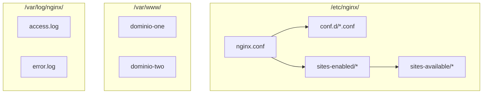

- [5. Despliegue de Servidores Web Nginx](#5-despliegue-de-servidores-web-nginx)
  - [5.1. Nginx Server](#51-nginx-server)
    - [5.1.1. Protocolo HTTP](#511-protocolo-http)
  - [5.2. Estructura de Directorios](#52-estructura-de-directorios)
  - [5.3. Comandos de Gestión](#53-comandos-de-gestión)
  - [5.4. Configuración Principal](#54-configuración-principal)
  - [5.5. Host Virtuales](#55-host-virtuales)
  - [5.6. Sites Available/Enables](#56-sites-availableenables)
  - [5.7. Dar de alta en la resolución de nombres del sistema operativo](#57-dar-de-alta-en-la-resolución-de-nombres-del-sistema-operativo)
  - [5.8. Despliegue con Docker](#58-despliegue-con-docker)
    - [5.8.1. Activación Modular en Docker](#581-activación-modular-en-docker)
    - [5.8.2. Logs y Monitorización en Contenedores](#582-logs-y-monitorización-en-contenedores)
  - [5.9. Práctica Nginx 01](#59-práctica-nginx-01)
  - [5.10. Protegiendo un directorio o dominio](#510-protegiendo-un-directorio-o-dominio)
  - [5.11. Practica Nginx 02](#511-practica-nginx-02)
  - [5.12. Seguridad con SSL/TSL](#512-seguridad-con-ssltsl)
  - [5.13. Practica Nginx 03](#513-practica-nginx-03)
  - [5.14. Administración y Documentación Esencial](#514-administración-y-documentación-esencial)
    - [5.14.1. Comandos de Administración de Contenedores](#5141-comandos-de-administración-de-contenedores)
    - [5.14.2. Documentación Esencial (*README.md*)](#5142-documentación-esencial-readmemd)
      - [Despliegue de Nginx con Docker Compose](#despliegue-de-nginx-con-docker-compose)
  - [5.15. Monitorización de Logs Estructurados](#515-monitorización-de-logs-estructurados)
    - [5.15.1. Logs y Rotación Básica (json-file driver)](#5151-logs-y-rotación-básica-json-file-driver)
    - [5.15.2. Consolidación y Análisis Centralizado (Log Shippers)](#5152-consolidación-y-análisis-centralizado-log-shippers)
    - [5.15.3. Consolidación de Logs con Fluentd](#5153-consolidación-de-logs-con-fluentd)
      - [Paso 1: Estructura de Archivos](#paso-1-estructura-de-archivos)
      - [Configuración de Fluentd (`fluentd/td-agent.conf`)](#configuración-de-fluentd-fluentdtd-agentconf)
      - [Paso 3: Actualizar Docker Compose (`docker-compose.yml`)](#paso-3-actualizar-docker-compose-docker-composeyml)
      - [Paso 4: Ejecución y Verificación](#paso-4-ejecución-y-verificación)
  - [5.16. Herramientas Clave de Visualización de Logs](#516-herramientas-clave-de-visualización-de-logs)
    - [5.16.1. Kibana (Elastic Stack)](#5161-kibana-elastic-stack)
      - [Actualizar Docker Compose para ELK](#actualizar-docker-compose-para-elk)
      - [Ejecución y Uso de Kibana](#ejecución-y-uso-de-kibana)


# 5. Despliegue de Servidores Web Nginx

## 5.1. Nginx Server

Nginx es un servidor web de alto rendimiento usado tanto como servidor estático como proxy reverso, balanceador y servidor de aplicaciones (via FastCGI/uWSGI). Sirve archivos estáticos, proxy-pasa peticiones a backends y gestiona TLS/SSL, compresión, caché y más.

💡 **Tip del Examinador:** Nginx es conocido por su alto rendimiento y bajo consumo de memoria. Es ideal para servir contenido estático y como proxy inverso.

### 5.1.1. Protocolo HTTP

(NOTA: la sección de HTTP ya está explicada en el documento de Apache. Aplican los mismos conceptos: métodos, códigos de estado, encabezados, stateless, etc.)

## 5.2. Estructura de Directorios

En sistemas Debian/Ubuntu la estructura típica es:

```
/etc/nginx/
|-- nginx.conf
|-- conf.d/
|   `-- *.conf
|-- sites-available/
|   `-- *.conf
`-- sites-enabled/
    `-- *.conf
/var/www/
|-- dominio-one/
|-- dominio-two/
/var/log/nginx/
|-- access.log
|-- error.log
```

- nginx.conf: archivo principal.
- conf.d/: configuraciones adicionales.
- sites-available/: bloques server (virtual hosts) disponibles.
- sites-enabled/: enlaces a los sites activados.
- /var/www/: document roots.
- /var/log/nginx/: logs de acceso y error.



## 5.3. Comandos de Gestión

Comprobar el estado:

```bash
sudo service nginx status
# o con systemd
sudo systemctl status nginx
```

Parar, iniciar, reiniciar:

```bash
sudo systemctl stop nginx
sudo systemctl start nginx
sudo systemctl restart nginx
sudo systemctl reload nginx    # recarga sin cortar conexiones
```

Ver versión:

```bash
nginx -v
nginx -V   # muestra compilación y módulos
```

Validar la configuración:

```bash
sudo nginx -t
```

Listar procesos:

```bash
ps aux | grep nginx
```

Ver logs en tiempo real:

```bash
tail -f /var/log/nginx/access.log /var/log/nginx/error.log
```

📝 **Nota del Profesor:** El comando `nginx -t` es esencial antes de recargar. Valida la sintaxis de todos los archivos de configuración.

## 5.4. Configuración Principal

Ejemplo simplificado de /etc/nginx/nginx.conf:

```nginx
user www-data;
worker_processes auto;
pid /run/nginx.pid;
error_log /var/log/nginx/error.log warn;
include /etc/nginx/modules-enabled/*.conf;

events {
    worker_connections 1024;
    use epoll;
}

http {
    sendfile on;
    tcp_nopush on;
    tcp_nodelay on;
    keepalive_timeout 65;
    types_hash_max_size 2048;

    include /etc/nginx/mime.types;
    default_type application/octet-stream;

    access_log /var/log/nginx/access.log;
    error_log /var/log/nginx/error.log warn;

    gzip on;

    include /etc/nginx/conf.d/*.conf;
    include /etc/nginx/sites-enabled/*;
}
```

Explicaciones rápidas:
- include sites-enabled: permite añadir virtual hosts.
- gzip y sendfile: optimizaciones.
- keepalive_timeout y worker_processes: ajustes de rendimiento.

## 5.5. Host Virtuales

Un bloque server (virtual host) para HTTP:

```nginx
server {
    listen 80;
    server_name dominio.com www.dominio.com;

    root /var/www/dominio.com;
    index index.html index.htm index.php;

   /log/nginx/domin access_log /vario.com_access.log;
    error_log /var/log/nginx/dominio.com_error.log;

    location / {
        try_files $uri $uri/ =404;
    }

    # Ejemplo para PHP usando php-fpm
    location ~ \.php$ {
        include snippets/fastcgi-php.conf;
        fastcgi_pass unix:/run/php/php8.1-fpm.sock;
    }
}
```

Para HTTPS (más abajo en la sección SSL/TSL se amplía).

💡 **Tip del Examinador:** Los bloques `location` son muy flexibles. Pueden hacer match por prefijo, expresiones regulares, y más.

## 5.6. Sites Available/Enables

Activar un site:

```bash
sudo cp /etc/nginx/sites-available/default /etc/nginx/sites-available/mi-sitio.conf
sudo ln -s /etc/nginx/sites-available/mi-sitio.conf /etc/nginx/sites-enabled/
sudo nginx -t
sudo systemctl reload nginx
```

Desactivar:

```bash
sudo rm /etc/nginx/sites-enabled/mi-sitio.conf
sudo nginx -t
sudo systemctl reload nginx
```

Es habitual usar scripts que crean/suprimen enlaces si trabajas con contenedores.

## 5.7. Dar de alta en la resolución de nombres del sistema operativo

Para pruebas locales añade en /etc/hosts (Linux/Mac) o C:\Windows\System32\drivers\etc\hosts (Windows):

```text
127.0.0.1 dominio-one.com
127.0.0.1 dominio-two.com
```

⚠️ **Advertencia de Seguridad:** Modificar el archivo hosts puede ser usado por malware para redireccionar sitios legítimos.

## 5.8. Despliegue con Docker

Se puede desplegar Nginx en Docker con configuración montada por volúmenes para sites-available y contenidos.

Estructura propuesta en el proyecto:

```
/nginx-project
├─ docker-compose.yml
├─ Dockerfile (opcional, para añadir utilidades)
├─ nginx/
│  ├─ nginx.conf
│  ├─ sites-available/
│  │  ├─ dominio-one.conf
│  │  └─ dominio-two.conf
│  └─ conf.d/
├─ websites/
│  ├─ dominio-one/
│  │  └─ index.html
│  └─ dominio-two/
│     └─ index.html
├─ certs/
│  ├─ dominio-two.crt
│  └─ dominio-two.key
└─ nginx-init.sh
```

Ejemplo mínimo de docker-compose.yml para desarrollo:

```yaml
version: '3.8'
services:
  web:
    image: nginx:stable
    container_name: nginx_server
    ports:
      - "8080:80"
      - "8443:443"
    volumes:
      - ./nginx/nginx.conf:/etc/nginx/nginx.conf:ro
      - ./nginx/sites-available:/etc/nginx/sites-available:ro
      - ./nginx/sites-enabled:/etc/nginx/sites-enabled:rw
      - ./websites:/var/www:ro
      - ./certs:/etc/nginx/certs:ro
      - ./nginx-init.sh:/usr/local/bin/nginx-init.sh:ro
    entrypoint: ["/usr/local/bin/nginx-init.sh"]
    restart: always
    networks:
      - webnet

networks:
  webnet:
```

nginx-init.sh (entrypoint) — se encarga de crear enlaces y lanzar nginx:

```bash
#!/bin/bash
set -e

# Crear enlaces simbólicos a sites-enabled si no existen
for f in /etc/nginx/sites-available/*; do
  fname=$(basename "$f")
  if [ ! -L /etc/nginx/sites-enabled/"$fname" ]; then
    ln -s "$f" /etc/nginx/sites-enabled/"$fname"
  fi
done

# Validar configuración
nginx -t

# Iniciar Nginx en primer plano
nginx -g 'daemon off;'
```

### 5.8.1. Activación Modular en Docker

Nginx no usa a2enmod/a2dismod: los módulos están incorporados en la binario o como módulos dinámicos. Si necesitas módulos adicionales, construye una imagen custom basada en alpine/nginx o nginx:stable con los módulos compilados o instalados (ej. nginx-extras en Debian). Ejemplo Dockerfile para añadir paquetes:

```dockerfile
FROM nginx:stable
RUN apt-get update && apt-get install -y vim curl apache2-utils
# Copia de config si es necesario
COPY ./nginx /etc/nginx
```

### 5.8.2. Logs y Monitorización en Contenedores

Concepto: Nginx debe enviar logs a stdout/stderr para que Docker los recoja. En la imagen oficial los access/error logs están en /var/log/nginx y la imagen normalmente ya escribe a stdout via configuración o se puede configurar:

En nginx.conf:

```nginx
access_log /dev/stdout combined;
error_log /dev/stderr warn;
```

Así Docker los captura y el logging driver del motor (json-file, fluentd, etc.) los procesa.

Para producción es recomendable redirigir a stdout/stderr y usar logging drivers o sidecars (Fluentd/Logstash).

📝 **Nota del Profesor:** En Docker, los logs deben ir a stdout/stderr. Docker los captura y permite verlos con `docker logs`.

## 5.9. Práctica Nginx 01

Crear dos páginas web en dos dominios tunombre.net y tunombre.org con un mensaje de bienvenida en cada una. Desplegar Nginx con Docker-Compose y configurar virtual hosts.

Pasos resumidos:
1. Crear carpetas websites/tunombre.net e websites/tunombre.org con index.html.
2. Crear archivos nginx/sites-available/tunombre.net.conf y tunombre.org.conf.
3. Montar volúmenes y lanzar docker-compose.
4. Añadir entradas a /etc/hosts para pruebas.

Ejemplo de archivo de site (tunombre.net.conf):

```nginx
server {
    listen 80;
    server_name tunombre.net www.tunombre.net;

    root /var/www/tunombre.net;
    index index.html;

    location / {
        try_files $uri $uri/ =404;
    }
}
```

## 5.10. Protegiendo un directorio o dominio

Nginx soporta autenticación HTTP Basic con un archivo htpasswd. Para generarlo:

Opción 1: usar apache2-utils (htpasswd):

```bash
sudo apt-get install apache2-utils
htpasswd -c ./nginx/.htpasswd usuario
# para añadir más usuarios:
htpasswd ./nginx/.htpasswd otro-usuario
```

Opción 2: usar openssl para generar MD5 apr1 (menos directo). Mejor usar htpasswd.

Ejemplo de configuración en el server block:

```nginx
location /privado {
    auth_basic "Área restringida";
    auth_basic_user_file /etc/nginx/.htpasswd;
    try_files $uri $uri/ =404;
}
```

En Docker, monta el archivo .htpasswd en /etc/nginx/.htpasswd.

## 5.11. Practica Nginx 02

Crea un directorio privado en tunombre.org y menghubégalo con contraseña (por ejemplo usuario pepeperez). Despliega Nginx en Docker-Compose con dos dominios virtuales y añade páginas personalizadas de error 404 y 500.

Ejemplo de error pages:

```nginx
error_page 404 /custom_404.html;
error_page 500 502 503 504 /custom_50x.html;

location = /custom_404.html {
    root /var/www/tunombre.org;
    internal;
}
location = /custom_50x.html {
    root /var/www/tunombre.org;
    internal;
}
```

Asegúrate de que los archivos custom_404.html y custom_50x.html existan en el document root.

## 5.12. Seguridad con SSL/TSL

Generar certificados autofirmados (para pruebas) con OpenSSL:

```bash
mkdir -p certs
openssl req -x509 -nodes -days 365 -newkey rsa:2048 \
  -keyout certs/dominio-two.key -out certs/dominio-two.crt \
  -subj "/C=ES/ST=Estado/L=Ciudad/O=Org/OU=IT/CN=dominio-two.com"
```

Configurar server blocks para redirigir HTTP a HTTPS y configurar TLS:

```nginx
# Redirigir todo HTTP a HTTPS
server {
    listen 80;
    server_name dominio-two.com www.dominio-two.com;
    return 301 https://$host$request_uri;
}

# HTTPS
server {
    listen 443 ssl;
    server_name dominio-two.com www.dominio-two.com;

    ssl_certificate /etc/nginx/certs/dominio-two.crt;
    ssl_certificate_key /etc/nginx/certs/dominio-two.key;

    ssl_protocols TLSv1.2 TLSv1.3;
    ssl_prefer_server_ciphers on;
    ssl_ciphers 'ECDHE-ECDSA-AES256-GCM-SHA384:ECDHE-RSA-AES256-GCM-SHA384:...';

    root /var/www/dominio-two.com;
    index index.html index.htm;

    location / {
        try_files $uri $uri/ =404;
    }

    # Protegido con Basic Auth
    location /privado {
        auth_basic "Acceso Restringido";
        auth_basic_user_file /etc/nginx/.htpasswd;
    }
}
```

En docker-compose mapear puerto 443 (ej. "8443:443" para no requerir privilegios o evitar conflicto).

Habilitar HSTS y mejoras de seguridad (ejemplo mínimo):

```nginx
add_header Strict-Transport-Security "max-age=31536000; includeSubDomains; preload" always;
add_header X-Frame-Options DENY;
add_header X-Content-Type-Options nosniff;
```

⚠️ **Advertencia de Seguridad:** Los certificados autofirmados muestran advertencias en el navegador. Solo para desarrollo.

Para producción usa certificados de Let's Encrypt (certbot) y configuración ACME. En Docker puedes usar containers como certbot/certbot o Traefik para manejo automático de certificados.

## 5.13. Practica Nginx 03

Configura tunombre.org con SSL/TLS en Docker-Compose. Pasos:
1. Generar/copiar certificados a ./certs.
2. Definir server blocks con listen 443 ssl y redirección 80->443.
3. Montar volúmenes en docker-compose y exponer puertos.
4. Probar con https://tunombre.org:8443 (según mapeo).

## 5.14. Administración y Documentación Esencial

Para administrar Nginx en Docker Compose se usan comandos de Docker. Mantén un README con pasos de despliegue y runbook.

### 5.14.1. Comandos de Administración de Contenedores

- Despliegue inicial:
```bash
docker-compose up -d
```

- Acceso a consola:
```bash
docker exec -it nginx_server bash
```

- Verificar configuración de Nginx dentro del contenedor:
```bash
docker exec nginx_server nginx -t
```

- Recarga de configuración:
```bash
docker exec nginx_server nginx -s reload
```

- Parada segura:
```bash
docker-compose stop
```

- Limpieza total:
```bash
docker-compose down
docker-compose down -v   # elimina volúmenes
```

- Reconstrucción forzada:
```bash
docker-compose up -d --build
```

💡 **Tip del Examinador:** `nginx -s reload` permite actualizar la configuración sin cortar las conexiones activas.

### 5.14.2. Documentación Esencial (*README.md*)

Contenido mínimo recomendado para el proyecto (ejemplo en texto):

- Requisitos: Docker Engine, Docker Compose.
- Estructura del proyecto (lista de carpetas y archivos).
- Pasos para ejecutar:
  1. Añadir entradas en /etc/hosts para pruebas locales.
  2. docker-compose up -d
  3. docker logs -f nginx_server
- Comandos de mantenimiento y comprobaciones (nginx -t, nginx -s reload).
- Descripción de cómo generar certificados y cómo proteger rutas (htpasswd).
- Enlace a directorio de fluentd/ELK para monitorización de logs.

#### Despliegue de Nginx con Docker Compose

Ejemplo de README breve:

```
Requisitos:
- Docker
- Docker Compose

Iniciar:
1. Copiar ejemplo de .env si existe.
2. docker-compose up -d
3. Validar: docker exec nginx_server nginx -t
4. Accede a http://dominio-one.com:8080 y https://dominio-two.com:8443 (según mapeo)
```

## 5.15. Monitorización de Logs Estructurados

Nginx debe enviar access_log a stdout y error_log a stderr. Ya vimos la configuración en nginx.conf:

```nginx
access_log /dev/stdout combined;
error_log /dev/stderr warn;
```

### 5.15.1. Logs y Rotación Básica (json-file driver)

En docker-compose, configura logging driver json-file con rotación:

```yaml
services:
  web:
    image: nginx:stable
    logging:
      driver: "json-file"
      options:
        max-size: "10m"
        max-file: "3"
```

### 5.15.2. Consolidación y Análisis Centralizado (Log Shippers)

Mejor opción para múltiples contenedores: usar fluentd/logstash/rsyslog para centralizar.

Ejemplo con Fluentd: el servicio web envía sus logs al colector fluentd usando el logging driver fluentd.

### 5.15.3. Consolidación de Logs con Fluentd

Objetivo: enviar logs de Nginx a Fluentd y desde Fluentd a almacenamiento o Elasticsearch.

#### Paso 1: Estructura de Archivos

```
/project
├─ docker-compose.yml
├─ nginx/
├─ websites/
└─ fluentd/
   ├─ td-agent.conf
   └─ logs/
```

#### Configuración de Fluentd (`fluentd/td-agent.conf`)

Archivo básico:

```conf
<source>
  @type forward
  port 24224
  bind 0.0.0.0
</source>

<match nginx.access>
  @type file
  path /fluentd/log/nginx_access
  <buffer>
    timekey 1d
    timekey_use_utc true
    flush_interval 1s
  </buffer>
</match>

<match nginx.error>
  @type file
  path /fluentd/log/nginx_error
  <buffer>
    timekey 1d
    timekey_use_utc true
    flush_interval 1s
  </buffer>
</match>
```

En este ejemplo el tag que el logging driver debe usar será `nginx.access` o `nginx.error`.

#### Paso 3: Actualizar Docker Compose (`docker-compose.yml`)

Ejemplo combinado:

```yaml
version: '3.8'
services:
  web:
    image: nginx:stable
    container_name: nginx_server
    ports:
      - "8080:80"
    volumes:
      - ./websites:/var/www:ro
      - ./nginx/sites-available:/etc/nginx/sites-available:ro
      - ./nginx/sites-enabled:/etc/nginx/sites-enabled:rw
    logging:
      driver: "fluentd"
      options:
        fluentd-address: fluentd:24224
        tag: nginx.access

  fluentd:
    image: fluent/fluentd:v1.15-1
    container_name: log_collector
    ports:
      - "24224:24224"
    volumes:
      - ./fluentd/td-agent.conf:/fluentd/etc/td-agent.conf:ro
      - ./fluentd/logs:/fluentd/log
    restart: always

networks:
  default:
    name: logs_network
```

Nota: dependiendo de la imagen de Fluentd podría necesitar plugins (ej. output-elasticsearch).

#### Paso 4: Ejecución y Verificación

1. docker-compose up -d
2. Generar tráfico a Nginx
3. Comprobar archivos en fluentd/logs en el host

```bash
ls fluentd/log
cat fluentd/log/nginx_access.*
```

## 5.16. Herramientas Clave de Visualización de Logs

Las mismas herramientas aplican: Kibana + Elasticsearch (ELK), Grafana, Graylog, etc.

### 5.16.1. Kibana (Elastic Stack)

Si quieres enviar logs a Elasticsearch en lugar de archivo:

Extender td-agent.conf para enviar a Elasticsearch:

```conf
<match nginx.access>
  @type elasticsearch
  host elasticsearch
  port 9200
  logstash_format true
  index_name nginx-logs
</match>
```

#### Actualizar Docker Compose para ELK

Añadir servicios elasticsearch y kibana:

```yaml
  elasticsearch:
    image: docker.elastic.co/elasticsearch/elasticsearch:8.10.2
    environment:
      - discovery.type=single-node
      - xpack.security.enabled=false
    volumes:
      - esdata:/usr/share/elasticsearch/data
    ports:
      - "9200:9200"

  kibana:
    image: docker.elastic.co/kibana/kibana:8.10.2
    environment:
      - ELASTICSEARCH_HOSTS=http://elasticsearch:9200
    ports:
      - "5601:5601"
    depends_on:
      - elasticsearch
```

Volumes:

```yaml
volumes:
  esdata:
```

#### Ejecución y Uso de Kibana

1. docker-compose up -d (puede tardar)
2. Abrir http://localhost:5601
3. Crear patrón de índice en Kibana que coincida con lo que Fluentd envía (nginx-logs* o similar)
4. Usar Discover y Dashboards para visualizar.

📝 **Nota del Profesor:** ELK es el estándar de facto para centralización de logs. Dominarlo es muy valorado en la industria.
