- [6. Proxy Inverso con Nginx, Balanceo de Carga y SSL con Docker Compose](#6-proxy-inverso-con-nginx-balanceo-de-carga-y-ssl-con-docker-compose)
  - [6.1. ¿Qué es un proxy inverso?](#61-qué-es-un-proxy-inverso)
  - [6.2. Ventajas del uso de un proxy inverso](#62-ventajas-del-uso-de-un-proxy-inverso)
  - [6.3. Configuración de un proxy inverso con Nginx](#63-configuración-de-un-proxy-inverso-con-nginx)
  - [6.4. Ejemplo básico de configuración](#64-ejemplo-básico-de-configuración)
  - [6.5. Proxy Inverso como API Gateway](#65-proxy-inverso-como-api-gateway)
  - [6.6. Balanceo de carga con Nginx (`upstream`)](#66-balanceo-de-carga-con-nginx-upstream)
    - [6.6.1. Algoritmos de balanceo](#661-algoritmos-de-balanceo)
  - [6.7. Alta disponibilidad y escalabilidad con Docker Compose (`--scale`)](#67-alta-disponibilidad-y-escalabilidad-con-docker-compose---scale)
  - [6.8. Service Discovery en Docker Compose](#68-service-discovery-en-docker-compose)
  - [6.9. Redes internas en Docker Compose](#69-redes-internas-en-docker-compose)
  - [6.10. Arquitectura del sistema](#610-arquitectura-del-sistema)
  - [6.11. Estructura de archivos del proyecto](#611-estructura-de-archivos-del-proyecto)
  - [6.12. Ficheros completos del proyecto](#612-ficheros-completos-del-proyecto)
    - [6.12.1. `docker-compose.yml`](#6121-docker-composeyml)
    - [6.12.2. `proxy/nginx.conf`](#6122-proxynginxconf)
    - [6.12.3. `proxy/sites-enabled/default.conf`](#6123-proxysites-enableddefaultconf)
    - [6.12.4. `web/index.html`](#6124-webindexhtml)
    - [6.12.5. `apache/Dockerfile`](#6125-apachedockerfile)
    - [6.12.6. `apache/sites-available/000-default.conf`](#6126-apachesites-available000-defaultconf)
    - [6.12.7. `apache/website/index.html`](#6127-apachewebsiteindexhtml)
    - [6.12.8. `make-certs.sh`](#6128-make-certssh)
    - [6.12.9. `proxy/sites-enabled/ssl.conf`](#6129-proxysites-enabledsslconf)
  - [6.13. Laboratorio: Proxy Inverso con Nginx, Balanceo y SSL](#613-laboratorio-proxy-inverso-con-nginx-balanceo-y-ssl)
    - [6.13.1. Objetivos](#6131-objetivos)
    - [6.13.2. Pasos](#6132-pasos)
    - [6.13.3. Ejercicios](#6133-ejercicios)
    - [6.13.4. Comprobaciones](#6134-comprobaciones)
  - [6.14. Verificación y pruebas](#614-verificación-y-pruebas)
  - [6.15. Ejercicios propuestos](#615-ejercicios-propuestos)
  - [6.16. Conclusiones](#616-conclusiones)


# 6. Proxy Inverso con Nginx, Balanceo de Carga y SSL con Docker Compose

## 6.1. ¿Qué es un proxy inverso?

Un **proxy inverso** es un servidor que recibe solicitudes de clientes y las reenvía a uno o más servidores de origen o backend.  
El cliente nunca se comunica directamente con los servidores backend, sino que lo hace siempre a través del proxy.

Un proxy inverso se puede utilizar para:

- Balancear la carga entre varios servidores de origen.  
- Proporcionar alta disponibilidad y escalabilidad.  
- Proteger los servidores de origen de los ataques de denegación de servicio.  
- Cachear contenido estático para mejorar el rendimiento.  
- Enmascarar la dirección IP del servidor o del cliente.  
- Gestionar certificados SSL de forma centralizada.


💡 **Tip del Examinador:** El proxy inverso es el punto de entrada único. Esto permite balanceo, caché y seguridad centralizados.

---

## 6.2. Ventajas del uso de un proxy inverso

- **Balanceo de carga:** distribuye las peticiones entre varios servidores backend.  
- **Alta disponibilidad:** si una instancia falla, otras continúan atendiendo.  
- **Seguridad:** oculta los servidores internos del acceso directo.  
- **Caché y compresión:** mejora el rendimiento y reduce la carga.  
- **Centralización de SSL:** el proxy gestiona los certificados.  
- **Escalabilidad:** permite añadir o quitar instancias sin afectar al cliente.

📝 **Nota del Profesor:** Nginx como proxy inverso es una arquitectura muy común en producción. Aprende a configurarlo bien.

---

## 6.3. Configuración de un proxy inverso con Nginx

En un entorno Dockerizado, no necesitamos instalar Nginx manualmente, ya que se utiliza como contenedor.  
La idea es tener un contenedor **proxy** que reciba las peticiones externas y las distribuya a uno o varios contenedores backend.

---

## 6.4. Ejemplo básico de configuración

```nginx
events {}

http {
    server {
        listen 80;
        server_name dominio.com;

        location / {
            proxy_pass http://nginx_server;
            proxy_set_header Host $host;
            proxy_set_header X-Real-IP $remote_addr;
            proxy_set_header X-Forwarded-For $proxy_add_x_forwarded_for;
            proxy_set_header X-Forwarded-Proto $scheme;
        }

        location /one {
            proxy_pass http://nginx_server;
        }

        location /two {
            proxy_pass http://apache_server;
        }
    }
}
```

⚠️ **Advertencia de Seguridad:** Los headers como X-Forwarded-For pueden ser spoofados. Valida siempre en backend si es crítico.

## 6.5. Proxy Inverso como API Gateway

Un proxy inverso puede actuar como un **API Gateway**, dirigiendo las peticiones a diferentes servicios según la ruta solicitada. De esta manera , se centraliza el acceso a múltiples APIs siendo uno de los enfoques más comunes en arquitecturas de microservicios.

```nginx
http {
    server {
        listen 80;

        location /api {
            proxy_pass http://api_server;
        }

        location /auth {
            proxy_pass http://auth_server;
        }
    }
}
```

💡 **Tip del Examinador:** El API Gateway es el patrón estándar en microservicios. Un solo punto de entrada para múltiples servicios.

---

## 6.6. Balanceo de carga con Nginx (`upstream`)

Nginx permite agrupar varios servidores backend mediante la directiva `upstream`.
Así, el proxy puede distribuir las peticiones de manera automática.

```nginx
http {
    upstream web_backend {
        server web_backend1:80;
        server web_backend2:80;
        server web_backend3:80;
    }

    server {
        listen 80;

        location / {
            proxy_pass http://web_backend;
            proxy_set_header Host $host;
            proxy_set_header X-Real-IP $remote_addr;
        }
    }
}
```

---

### 6.6.1. Algoritmos de balanceo

Nginx permite distintos algoritmos de balanceo:

- **round-robin (por defecto):** envía las peticiones de manera alternada.
- **least_conn:** envía la petición al servidor con menos conexiones activas.
- **ip_hash:** siempre envía al mismo servidor en función de la IP del cliente.
- **hash $variable:** se puede usar cualquier variable para el reparto.

```mermaid
flowchart LR
    A[Cliente] --> P[Proxy Nginx]
    
    subgraph "Upstream Group"
        B1[Server 1]
        B2[Server 2]
        B3[Server 3]
    end
    
    P -->|1ª petición| B1
    P -->|2ª petición| B2
    P -->|3ª petición| B3
    P -->|4ª petición| B1
```



---

## 6.7. Alta disponibilidad y escalabilidad con Docker Compose (`--scale`)

Docker Compose permite ejecutar múltiples instancias del mismo servicio de forma sencilla:

```bash
docker compose up --scale web_backend=3 -d
```

Esto lanzará tres contenedores (`web_backend_1`, `web_backend_2`, `web_backend_3`) que recibirán las peticiones balanceadas por el proxy.

---

## 6.8. Service Discovery en Docker Compose

Docker Compose ofrece un sistema de **descubrimiento automático de servicios (Service Discovery)**.
Cada contenedor puede resolver el nombre de otro servicio dentro de la misma red usando su nombre como hostname.

Por ejemplo:

```nginx
proxy_pass http://web_backend:80;
```

Docker resolverá automáticamente ese nombre al conjunto de contenedores correspondientes.

💡 **Tip del Examinador:** No necesitas IPs fijas. Docker resuelve el nombre del servicio a todas las IPs de los contenedores.

---

## 6.9. Redes internas en Docker Compose

Para garantizar la seguridad del entorno:

1. Solo el proxy debe exponer puertos al exterior.
2. Los backends deben comunicarse exclusivamente a través de la red interna.

```yaml
networks:
  internal_net:
    driver: bridge
```

De esta forma, las peticiones externas llegan solo al proxy, y los contenedores internos no son accesibles directamente.


⚠️ **Advertencia de Seguridad:** Los backends nunca deben exponer puertos directamente. Solo el proxy es accesible públicamente.

---

## 6.10. Arquitectura del sistema

1. El cliente se conecta al **proxy Nginx**.
2. Nginx reenvía la petición al backend correspondiente (`web_backend`, `apache_server`, etc.).
3. Los backends devuelven la respuesta al proxy.
4. El proxy entrega la respuesta al cliente.

---

## 6.11. Estructura de archivos del proyecto

```
nginx-proxy-lb/
├── docker-compose.yml
├── proxy/
│   ├── nginx.conf
│   ├── sites-enabled/
│   │   ├── default.conf
│   │   └── ssl.conf
│   └── certs/
├── web/
│   └── index.html
├── apache/
│   ├── Dockerfile
│   ├── sites-available/
│   │   └── 000-default.conf
│   └── website/
│       └── index.html
├── make-certs.sh
└── README-LAB.md
```

---

## 6.12. Ficheros completos del proyecto

### 6.12.1. `docker-compose.yml`

```yaml
version: '3.8'

services:

  web_backend:
    image: nginx:stable-alpine
    volumes:
      - ./web:/usr/share/nginx/html:ro
    networks:
      - internal_net

  apache_server:
    build: ./apache
    networks:
      - internal_net

  proxy:
    image: nginx:stable-alpine
    container_name: proxy_server
    ports:
      - "80:80"
      - "443:443"
    volumes:
      - ./proxy/nginx.conf:/etc/nginx/nginx.conf:ro
      - ./proxy/sites-enabled:/etc/nginx/conf.d:ro
      - ./proxy/certs:/etc/nginx/certs:ro
    depends_on:
      - web_backend
      - apache_server
    networks:
      - internal_net

networks:
  internal_net:
    driver: bridge
```

---

### 6.12.2. `proxy/nginx.conf`

```nginx
user  nginx;
worker_processes  auto;
error_log  /var/log/nginx/error.log warn;
pid        /var/run/nginx.pid;

events {
    worker_connections 1024;
}

http {
    include       /etc/nginx/mime.types;
    default_type  application/octet-stream;
    access_log  /var/log/nginx/access.log  main;
    resolver 127.0.0.11 valid=10s;

    server {
        listen 80;
        server_name _;

        set $backend_host "web_backend:80";

        location /apellidos {
            proxy_pass http://apache_server;
            proxy_set_header Host $host;
            proxy_set_header X-Real-IP $remote_addr;
        }

        location /nombre {
            proxy_pass http://web_backend;
            proxy_set_header Host $host;
            proxy_set_header X-Real-IP $remote_addr;
        }

        location / {
            proxy_pass http://$backend_host;
            proxy_set_header Host $host;
            proxy_set_header X-Real-IP $remote_addr;
        }
    }
}
```

---

### 6.12.3. `proxy/sites-enabled/default.conf`

```nginx
server {
    listen 80;
    server_name dominio.local;

    location = / {
        return 302 /welcome;
    }

    location /welcome {
        root /usr/share/nginx/html;
        index index.html;
    }

    location /one {
        proxy_pass http://nginx_server;
    }

    location /two {
        proxy_pass http://apache_server;
    }

    location /nombre {
        proxy_pass http://web_backend;
    }

    location /apellidos {
        auth_basic "Área privada";
        auth_basic_user_file /etc/nginx/.htpasswd;
        proxy_pass http://apache_server;
    }
}
```

---

### 6.12.4. `web/index.html`

```html
<!DOCTYPE html>
<html lang="es">
<head>
    <meta charset="UTF-8">
    <title>Servidor Web Backend</title>
    <style>
        body { font-family: Arial, sans-serif; text-align: center; margin-top: 5em; }
        h1 { color: #3366cc; }
    </style>
</head>
<body>
    <h1>¡Hola desde el servidor backend!</h1>
    <p>Esta página se sirve desde una de las instancias balanceadas.</p>
</body>
</html>
```

---

### 6.12.5. `apache/Dockerfile`

```dockerfile
FROM httpd:2.4-alpine
COPY ./website/ /usr/local/apache2/htdocs/
COPY ./sites-available/000-default.conf /usr/local/apache2/conf/extra/httpd-vhosts.conf
```

---

### 6.12.6. `apache/sites-available/000-default.conf`

```apache
<VirtualHost *:80>
    DocumentRoot "/usr/local/apache2/htdocs"
    <Directory "/usr/local/apache2/htdocs">
        Options Indexes FollowSymLinks
        AllowOverride None
        Require all granted
    </Directory>
</VirtualHost>
```

---

### 6.12.7. `apache/website/index.html`

```html
<!DOCTYPE html>
<html lang="es">
<head><meta charset="UTF-8"><title>Zona Privada Apache</title></head>
<body>
  <h1>Zona Privada - Apellidos</h1>
  <p>Esta es la zona privada del servidor Apache protegida por usuario y contraseña.</p>
</body>
</html>
```

---

### 6.12.8. `make-certs.sh`

```bash
#!/usr/bin/env bash
set -e

mkdir -p proxy/certs
cd proxy/certs

DOMAIN="dominio.local"
DAYS=365

openssl genrsa -out ${DOMAIN}.key 2048
openssl req -new -key ${DOMAIN}.key -out ${DOMAIN}.csr -subj "/C=ES/ST=Madrid/CN=${DOMAIN}/O=DAW"
openssl x509 -req -in ${DOMAIN}.csr -signkey ${DOMAIN}.key -out ${DOMAIN}.crt -days ${DAYS}
cat ${DOMAIN}.key ${DOMAIN}.crt > ${DOMAIN}.pem

echo "Certificados generados en proxy/certs: ${DOMAIN}.key ${DOMAIN}.crt ${DOMAIN}.pem"
```

---

### 6.12.9. `proxy/sites-enabled/ssl.conf`

```nginx
server {
    listen 443 ssl;
    server_name dominio.local;

    ssl_certificate /etc/nginx/certs/dominio.local.crt;
    ssl_certificate_key /etc/nginx/certs/dominio.local.key;
    ssl_session_cache shared:SSL:10m;
    ssl_session_timeout 10m;
    ssl_protocols TLSv1.2 TLSv1.3;
    ssl_prefer_server_ciphers on;

    location / {
        proxy_pass http://web_backend;
        proxy_set_header Host $host;
        proxy_set_header X-Real-IP $remote_addr;
        proxy_set_header X-Forwarded-Proto https;
    }
}

server {
    listen 80;
    server_name dominio.local;
    return 301 https://$host$request_uri;
}
```

## 6.13. Laboratorio: Proxy Inverso con Nginx, Balanceo y SSL

### 6.13.1. Objetivos

- Comprender el funcionamiento de un proxy inverso.
- Configurar Nginx como balanceador de carga.
- Escalar backends con Docker Compose (`--scale`).
- Implementar Service Discovery en Docker.
- Configurar SSL con certificados autofirmados.

### 6.13.2. Pasos

1. Generar certificados:
   ```bash
   ./make-certs.sh
   ```

2. Iniciar el entorno:
   ```bash
   docker compose up --scale web_backend=3 -d
   ```

3. Comprobar contenedores:
   ```bash
   docker ps
   ```

4. Acceder en el navegador:
   - [http://localhost](http://localhost)
   - [https://localhost](https://localhost)

5. Escalar y observar:
   ```bash
   docker compose up --scale web_backend=5 -d
   ```

6. Ver logs:
   ```bash
   docker logs proxy_server
   ```

### 6.13.3. Ejercicios

1. Cambiar el algoritmo de balanceo a `least_conn`.
2. Añadir autenticación básica a `/apellidos`.
3. Mostrar el `hostname` del contenedor en la página web.
4. Simular la caída de una instancia y observar el balanceo.
5. Activar HTTPS y probar la conexión segura.

### 6.13.4. Comprobaciones

- `curl http://localhost`
- `curl -k https://localhost`
- `docker exec proxy_server nginx -s reload`

---

## 6.14. Verificación y pruebas

```bash
docker compose up --scale web_backend=3 -d
docker ps
curl http://localhost/
curl -k https://localhost/
docker logs proxy_server
```

---

## 6.15. Ejercicios propuestos

1. Configurar el proxy con algoritmo `ip_hash`.
2. Implementar healthchecks para backends.
3. Analizar los logs de Nginx para comprobar la distribución de carga.
4. Configurar HTTPS con certificados reales (Let's Encrypt).
5. Implementar una caché en el proxy para recursos estáticos.

📝 **Nota del Profesor:** Los healthchecks son esenciales en producción. Permiten detectar backends caídos automáticamente.

---

## 6.16. Conclusiones

- Nginx puede actuar como proxy inverso y balanceador de carga.
- Docker Compose permite escalar servicios fácilmente.
- Service Discovery simplifica la conexión entre contenedores.
- Las redes internas protegen los backends del acceso externo.
- La terminación SSL en el proxy centraliza la seguridad y simplifica la gestión de certificados.
