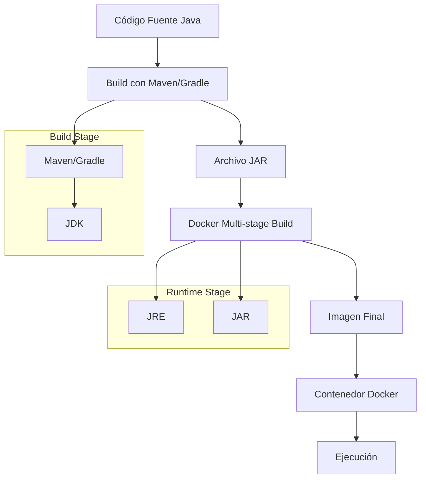

- [7. Despliegue de aplicación JVM](#7-despliegue-de-aplicación-jvm)
  - [7.1. Despliegue de aplicación JVM](#71-despliegue-de-aplicación-jvm)
  - [7.2. Compilando y Desplegar usando Docker](#72-compilando-y-desplegar-usando-docker)


# 7. Despliegue de aplicación JVM

## 7.1. Despliegue de aplicación JVM

Para desplegar una aplicación Java en un contenedor Docker, necesitarás un Dockerfile que defina cómo se va a construir tu contenedor y tu fichero jar.

```Dockerfile
# Usa una imagen base de Java 11 (puedes cambiar a la versión que necesites)
FROM openjdk:11-jdk

# Copia el archivo .jar de tu aplicación al contenedor, cuidado donde esta por ejemplo si 
# esta en un directorio target, lo copiará al directorio raíz del contenedor (Gradle o Maven)
COPY target/mi-aplicacion.jar mi-aplicacion.jar

# Define el comando para ejecutar tu aplicación
ENTRYPOINT ["java","-jar","/mi-aplicacion.jar"]
```

💡 **Tip del Examinador:** El Dockerfile multi-stage es la forma moderna de construir aplicaciones Java. Separa compilación de ejecución.

Este Dockerfile asume que tienes un archivo .jar llamado `mi-aplicacion.jar` en el directorio `target` de tu proyecto.

Para construir la imagen de Docker a partir de este Dockerfile, puedes usar el siguiente comando:

```bash
docker build -t mi-aplicacion .
```

Y para ejecutar el contenedor, puedes usar el siguiente comando, si por ejemplo usa un puerto:

```bash
docker run -p 8080:8080 mi-aplicacion
```

Este comando ejecutará tu aplicación y mapeará el puerto 8080 del contenedor al puerto 8080 de tu máquina local.

## 7.2. Compilando y Desplegar usando Docker

Para compilar y construir el archivo .jar dentro del contenedor Docker, puedes usar un enfoque de múltiples etapas en tu Dockerfile. Aquí hay un ejemplo de cómo hacerlo:

```Dockerfile
# Etapa de compilación su usas gradle cambia, esta etapa se llama build
FROM maven:3.8.1-openjdk-11-slim AS build

# Directorio de trabajo
WORKDIR /workspace/app

# Copia los archivos pom.xml y src. Cammbia al metodo con gadle
COPY mvnw .
COPY .mvn .mvn
COPY pom.xml .
COPY src src

# Compila y construye el proyecto, evita los test
RUN ./mvnw install -DskipTests

# Etapa de ejecución
FROM openjdk:11-jdk-slim

# Directorio de trabajo
WORKDIR /app

# Copia el archivo .jar de la etapa de compilación
COPY --from=build /workspace/app/target/mi-aplicacion.jar mi-aplicacion.jar

# Define el comando para ejecutar tu aplicación
ENTRYPOINT ["java","-jar","mi-aplicacion.jar"]
```

📝 **Nota del Profesor:** El patrón multi-stage reduce el tamaño final de la imagen. La imagen de producción solo contiene el JRE, no el JDK.

Si usamos Gradle

```Dockerfile
# Etapa de compilación, un docker especifico, que se etiqueta como build
FROM gradle:jdk17 AS build

# Directorio de trabajo
WORKDIR /app

# Copia los archivos build.gradle y src de nuestro proyecto
COPY build.gradle.kts .
COPY gradlew .
COPY gradle gradle
COPY src src

# Compila y construye el proyecto, podemos evitar los test evitando con -x test
RUN ./gradlew build

# Etapa de ejecución, un docker especifico, que se etiqueta como run
# Con una imagen de java
FROM openjdk:17-jdk AS run

# Directorio de trabajo
WORKDIR /app

# Copia el jar de la aplicación, ojo que esta en la etapa de compilación, etiquetado como build
# Cuidado con la ruta definida cuando has copiado las cosas en la etapa de compilación
# Para copiar un archivo de una etapa a otra, se usa la instrucción COPY --from=etapaOrigen
COPY --from=build /app/build/libs/*.jar /app/my-app.jar

# Expone el puerto 8080, pero en esta imagen no es necesario
# EXPOSE 8080
# Ejecuta el jar
ENTRYPOINT ["java","-jar","/app/my-app.jar"]
```

Este Dockerfile utiliza una imagen base de Maven para compilar y construir tu aplicación, y luego copia el archivo .jar resultante a una nueva imagen basada en OpenJDK.

Para ejecutar esta imagen hacemos lo siguiente:

```bash
# crear la imagen desde el dockerfile y la ejecuta. Abre los puertos si los necesitas
docker build -t my-app .
docker run -p 8080:8080 my-app
```

A continuación, puedes utilizar Docker Compose para gestionar tu aplicación. Aquí tienes un ejemplo básico de un archivo `docker-compose.yml`:

```yaml
version: '3.8'
services:
  mi-aplicacion:
    build:
      context: .
      dockerfile: Dockerfile
    ports:
      - "8080:8080"
```

Este archivo Docker Compose construirá y ejecutará tu aplicación utilizando el Dockerfile en el directorio actual, y mapeará el puerto 8080 (si no lo necessitas quítalo) del contenedor al puerto 8080 de tu máquina local.

Para construir y ejecutar tu aplicación con Docker Compose, puedes usar el siguiente comando:

```bash
docker-compose up --build
```

Este comando construirá la imagen de tu aplicación (si no se ha construido ya) y luego ejecutará el contenedor.



💡 **Tip del Examinador:** En producción, usa imágenes `openjdk:*-jre-slim` para reducir el tamaño. Solo necesitas el JDK para compilar.

⚠️ **Advertencia de Seguridad:** Las imágenes base oficiales de OpenJDK son seguras, pero siempre verifica que usas versiones actualizadas sin vulnerabilidades conocidas.
