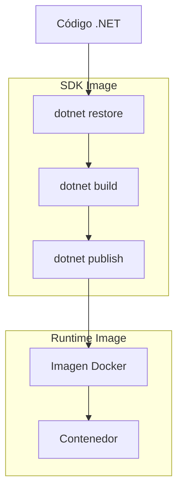
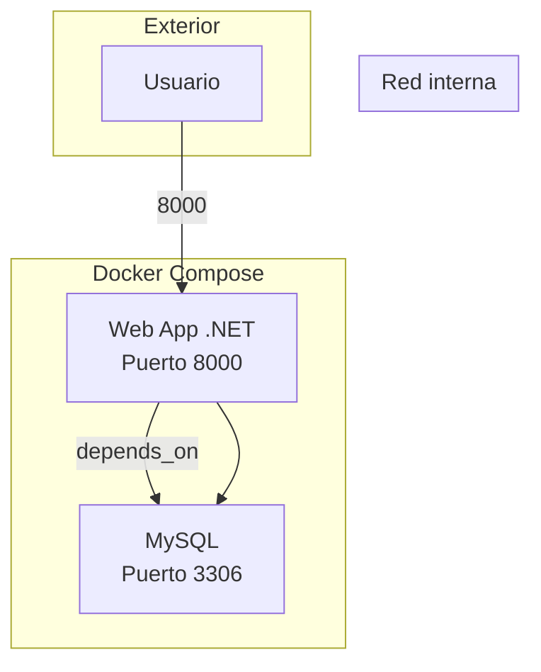

- [8. Despliegue de aplicación .NET](#8-despliegue-de-aplicación-net)
  - [8.1. Despliegue de aplicación .NET](#81-despliegue-de-aplicación-net)


# 8. Despliegue de aplicación .NET

## 8.1. Despliegue de aplicación .NET

Para desplegar una aplicación .Net en un contenedor Docker, necesitarás un Dockerfile que defina cómo se va a construir tu contenedor y tu ejecutable

```Dockerfile
# Etapa de compilación
FROM mcr.microsoft.com/dotnet/sdk:8.0 AS build-env
WORKDIR /app

# Copia csproj y restaura dependencias
COPY *.csproj ./
RUN dotnet restore

# Copia todo lo demás y compila
COPY . ./
RUN dotnet publish -c Release -o out

# Etapa de prueba
FROM build-env AS test-env
WORKDIR /app/tests
COPY ./tests ./
RUN dotnet test --logger:trx

# Etapa de ejecución
FROM mcr.microsoft.com/dotnet/aspnet:8.0
WORKDIR /app
COPY --from=build-env /app/out .
ENTRYPOINT ["dotnet", "your-app-name.dll"]

```

💡 **Tip del Examinador:** Microsoft mantiene imágenes oficiales en MCR (Microsoft Container Registry). Usa siempre las etiquetas de versión específicas.

Para construir la imagen de Docker a partir de este Dockerfile, puedes usar el siguiente comando:

```bash
docker build -t myapp .
```

Y para ejecutar el contenedor, puedes usar el siguiente comando, si por ejemplo usa un puerto:

```bash
docker run -p 8000:8080 -d myapp
```

Este comando ejecutará tu aplicación y mapeará el puerto 8080 del contenedor al puerto 8080 de tu máquina local.

📝 **Nota del Profesor:** .NET tiene excelente soporte nativo para Docker. Las imágenes son ligeras y optimizadas.



A continuación, puedes utilizar Docker Compose para gestionar tu aplicación. Aquí tienes un ejemplo básico de un archivo `docker-compose.yml` con una aplicación web y una base de datos MySQL:

```yaml
version: '3.8'
services:
  web:
    build: 
      context: .
      dockerfile: Dockerfile
    ports:
      - "8000:8080"
    depends_on:
      - db
  db:
    image: mysql:5.7
    environment:
      MYSQL_ROOT_PASSWORD: password
      MYSQL_DATABASE: testdb
      MYSQL_USER: user
      MYSQL_PASSWORD: password
    volumes:
      - db_data:/var/lib/mysql
    ports:
      - "3306:3306"

volumes:
  db_data:
```

Para construir y ejecutar tu aplicación con Docker Compose, puedes usar el siguiente comando:

```bash
docker-compose up --build
```

Este comando construirá la imagen de tu aplicación (si no se ha construido ya) y luego ejecutará el contenedor.

⚠️ **Advertencia de Seguridad:** Nunca expongas bases de datos directamente. En producción, usa redes internas y variables de entorno para secretos.



💡 **Tip del Examinador:** `depends_on` solo espera a que el contenedor inicie, no a que el servicio esté listo. Usa healthchecks para MySQL.
