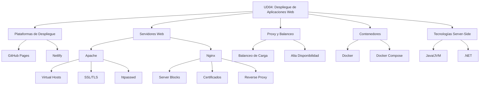

- [9. Resumen](#9-resumen)
  - [9.1. Mapa Conceptual de la Unidad](#91-mapa-conceptual-de-la-unidad)
  - [9.2. Conceptos Clave Detallados](#92-conceptos-clave-detallados)
    - [Plataformas de Hosting Estático](#plataformas-de-hosting-estático)
    - [Servidores Web: Apache vs Nginx](#servidores-web-apache-vs-nginx)
    - [Proxy Inverso y Balanceo de Carga](#proxy-inverso-y-balanceo-de-carga)
    - [Contenedores y Docker](#contenedores-y-docker)
    - [Despliegue de Aplicaciones JVM y .NET](#despliegue-de-aplicaciones-jvm-y-net)
  - [9.3. Comparativa de Tecnologías y Servidores](#93-comparativa-de-tecnologías-y-servidores)
  - [9.4. Checklist de Supervivencia](#94-checklist-de-supervivencia)

# 9. Resumen

## 9.1. Mapa Conceptual de la Unidad

## 9.2. Conceptos Clave Detallados

### Plataformas de Hosting Estático

**GitHub Pages** es un servicio de alojamiento gratuito para sitios web estáticos directamente desde un repositorio de GitHub. Se configura creando un repositorio `username.github.io` y habilitando Pages en Settings. Soporta Jekyll para generación estática y permite desplegar con GitHub Actions para CI/CD.

**Netlify** es una plataforma para desplegar sitios estáticos y aplicaciones JAMstack con integración con repositorios Git. Proporciona HTTPS automático, CDN global, funciones serverless (Netlify Functions), formularios y deploy previews.

### Servidores Web: Apache vs Nginx

**Apache HTTP Server** es un servidor web de código abierto muy popular. Utiliza archivos .htaccess para configuración por directorio, tiene una estructura modular con sites-available/sites-enabled y soporta múltiples lenguajes de programación via módulos.

**Nginx** es un servidor web de alto rendimiento usado como servidor estático y proxy reverso. Tiene una configuración más ligera que Apache, excelente manejo de conexiones concurrentes y se configura mediante archivos de bloques server.

### Proxy Inverso y Balanceo de Carga

Un proxy inverso es un servidor que recibe solicitudes de clientes y las reenvía a uno o más servidores de origen. Las ventajas incluyen balanceo de carga entre varios servidores, alta disponibilidad, seguridad al ocultar servidores internos, caché y compresión, y centralización de SSL.

Nginx permite balanceo de carga mediante la directiva `upstream`, distribuyendo peticiones entre varios backends usando algoritmos como round-robin, least_conn o ip_hash.

### Contenedores y Docker

Un contenedor es una unidad de software que empaqueta una aplicación y todas sus dependencias, de modo que la aplicación se pueda ejecutar rápidamente y de manera fiable en cualquier entorno. Docker facilita la creación, implementación y ejecución de aplicaciones en contenedores.

### Despliegue de Aplicaciones JVM y .NET

Para desplegar aplicaciones Java en Docker se usa un Dockerfile multietapa. La primera etapa compila el código (usando Maven o Gradle) y la segunda etapa copia el JAR ejecutable a una imagen base de OpenJDK.

Las aplicaciones .NET se despliegan en Docker usando la imagen base mcr.microsoft.com/dotnet/sdk para compilar y mcr.microsoft.com/dotnet/aspnet para ejecución.

## 9.3. Comparativa de Tecnologías y Servidores

| Aspecto | Apache | Nginx |
|---------|--------|-------|
| **Modelo de proceso** | Por petición (hilos) | Event-driven (async) |
| **Rendimiento estático** | Bueno | Excelente |
| **Configuración** | .htaccess distribuida | Centralizada |
| **Proxy inverso** | Con módulo mod_proxy | Nativo y optimizado |

| Plataforma | Tipo | Ideal para |
|------------|------|------------|
| GitHub Pages | Estático | Documentación, portfolios |
| Netlify | Estático + Serverless | JAMstack, Functions |
| Docker | Contenedores | Cualquier aplicación |
| JVM/.NET | Contenedores | Aplicaciones empresariales |

## 9.4. Checklist de Supervivencia

Antes de dar por cerrado el tema, asegúrate de poder responder **SÍ** a estas preguntas:

- [ ] ¿Sé configurar virtual hosts en Apache y server blocks en Nginx?
- [ ] ¿Entiendo la diferencia entre un servidor web estático y uno dinámico?
- [ ] ¿Puedo explicar qué es un proxy inverso y para qué sirve?
- [ ] ¿Sé configurar balanceo de carga con Nginx usando `upstream`?
- [ ] ¿Conozco los comandos básicos de gestión de Apache y Nginx (`service`, `systemctl`, `nginx -t`)?
- [ ] ¿Puedo generar certificados SSL autofirmados con OpenSSL?
- [ ] ¿Sé proteger un directorio con autenticación Basic Auth (htpasswd)?
- [ ] ¿Entiendo cómo funciona Service Discovery en Docker Compose?
- [ ] ¿Puedo crear un Dockerfile multietapa para Java?
- [ ] ¿Sé escalar servicios con `docker compose up --scale`?

📝 **Nota del Profesor:** Este checklist te ayuda a verificar que dominas todos los conceptos de la UD04. Repasa los que no tengas marcados.

💡 **Tip del Examinador:** Practica el despliegue completo de un sitio con SSL desde cero. Es un ejercicio clásico de examen.
